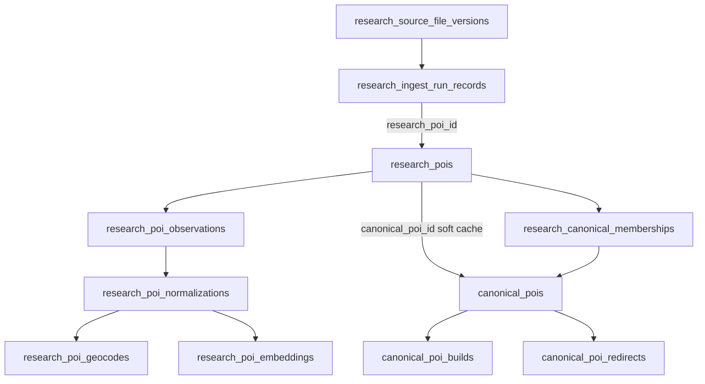

# End-to-End Ingest Lineage and Cleanup

## Current state (from research)

The happy-path chain already exists but has weak links. Today's lineage:

Key gaps found:

- `research_canonical_memberships` is written but never read; `research_pois.canonical_poi_id` is the operational truth. `reflow.ts` clears the pointer without retiring memberships (divergence bug).
- No `active_geocode_id`/`active_embedding_id` — the artifact that produced `research_pois.lat/lng/content_embedding` must be inferred by hash.
- `canonical_poi_builds` records inputs only in JSON (`input_hash`, `field_provenance`); no relational build-inputs table, so "which research rows built this canonical" is not queryable/enforceable.
- `canonical_poi_redirects` has no FK to `research_consolidation_decisions`; both are write-only.
- Canonicals have no `origin` marker (research-derived vs manual), so deletion safety is undecidable.
- Legacy `ingest:extract` path skips `research_ingest_runs`/`research_source_file_versions` lineage.
- `clean.ts` works one record at a time and rebuilds/deletes canonicals based only on `canonical_poi_id` counts; it never consults memberships, redirects, or build inputs.
- **Record identity is broken for id-less sources.** The generic extractor keys records as `source_record_id ?? id ?? source_url` ([extractors/generic.ts](lib/db-map/scripts/ingest/extractors/generic.ts) lines 57-58). Files like `artfairslist.json` share one homepage `source_url` across all records, so every record upserts the same `(source_id, source_record_id)` row — data is silently overwritten, downstream sees one row, and orphaned canonicals get hidden. `synthSourceRecordId()` in [hash.ts](lib/db-map/scripts/ingest/hash.ts) was built for this but is never called. There is also no duplicate-key detection at extract time, so collisions are invisible.
- Survey of all 234 files in `docs/poi/` (~150k records): `name` is ~100% present; city/coords/dates vary by source family; API feeds carry natural ids (`mbid`, `slug`, `wikidata_qid`, `artsy_id`, `detail_url`); scraped directories mostly don't. Same name+city with different dates is common and intentional (per-edition sources like `maker_faire.json`, `festival_alarm_festivals.json`), while other sources are one-row-per-series (`biennial_foundation.json`) — so whether dates belong in identity is per-source, not global. The `docs/poi-research/capture-spec.md` referenced everywhere does not exist in the repo.

## 0. Record identity: stable `source_record_id` for every record

This comes first because everything else (lineage, trace, clean, re-ingest) keys off `(source_id, source_record_id)`.

### Identity ladder (in the generic extractor, configurable per source)

1. **Explicit id:** `source_record_id`, else a natural id field. Extend the current `id`-only fallback to known natural ids: `slug`, `mbid`, `wikidata_qid`/`wikidata_id`, `artsy_id`, `ra_event_id`. Sources in [sources.ts](lib/db-map/scripts/ingest/sources.ts) may pin the field explicitly (`identity: { field: "mbid" }`).
2. **Per-record unique URL:** `detail_url`, or `source_url`/`url` — but only when unique within the file (see collision guard below). Never use a URL that repeats across records as identity.
3. **Synthetic semantic key (the fix for artfairslist-class files):** deterministic hash of required stable fields via the existing `synthSourceRecordId()`, extended to:
   - `sourceSlug | name | locality | [edition]`
   - `locality` = city+region+country when present, else rounded coordinates (~3 decimals), else address string. Hostels (no city field) fall to coords; craft-show scrapes fall to city.
   - `edition` = `start_date` (year at minimum), included only when the source registry marks `identity: { editioned: true }` (per-edition sources like `maker_faire`); omitted for series sources (`biennial_foundation`). Per-edition research rows are correct — matching/consolidation merges editions into one canonical and occurrences model the dates.
   - Full-record hashing is deliberately rejected: any property change would mint a new identity and break re-ingest idempotency. Name+locality(+edition) survives value tweaks; if a name or city genuinely changes, the old row retires via snapshot mode and the new row re-matches to the same canonical — acceptable and traceable.

### Collision guard at extract (no more silent overwrites)

In [orchestrator.ts](lib/db-map/scripts/ingest/orchestrator.ts) `extractFile`, track final `source_record_id`s seen within the file version (in-memory set; files are local so this is cheap):

- Same id + same `raw_content_hash` → true duplicate; skip, mark run record `extract_state='duplicate'`.
- Same id + different hash → collision; do **not** overwrite. Mark run record `extract_state='collision'` with both ordinals in the error detail, and fail the run summary loudly so the source file or identity config gets fixed. This single check would have caught the artfairslist bug immediately.
- Additionally: if strategy 2 (URL) yields a value already seen in the file, demote that record to strategy 3 automatically (a shared homepage never becomes an identity).

### Identity provenance (schema, folded into the migration in section 1)

- `research_pois.source_record_id_kind text NOT NULL DEFAULT 'natural'` (`natural` | `url` | `synthetic`) plus `identity_inputs jsonb NULL` storing the synthetic key components (name, locality, edition used). The admin tool and `clean` display this; `ingest:verify` checks synthetic ids recompute correctly from `identity_inputs`.
- New `extract_state` values (`duplicate`, `collision`) on `research_ingest_run_records`.

### Field alias fixes (same extractor pass)

- Map `website_url` → `website` (currently dropped to attributes, so official sites never land on the website column), `detail_url` → `source_url` when `source_url` is absent, `title` → `name` (already done), `venue_name`/`street_address` kept as today.

### Capture spec

- Write the missing `docs/poi-research/capture-spec.md` documenting: required fields, the identity ladder, when to supply `source_record_id`, per-edition vs per-series sources, and `website` vs `source_url` roles. It is referenced by three AGENTS/docs files but doesn't exist.

### Clean/trace implications

Because synthetic ids are deterministic from source data, `ingest:clean --file` and `ingest:trace --file` recompute ids from the file through the same extractor and resolve exactly the same rows — no reliance on the file being unchanged in the DB.

## 1. Schema migration (new file in [lib/db-map/migrations/](lib/db-map/migrations/))

One migration, then `pnpm db:sync`:

- **Build inputs (the core fix):** new table `canonical_poi_build_inputs`
  — `(build_id FK→canonical_poi_builds CASCADE, research_poi_id uuid, normalization_id uuid, geocode_id uuid NULL, embedding_id uuid NULL, membership_id uuid NULL)`, unique `(build_id, research_poi_id)`. Input ids are recorded as plain uuids (no FK to research tables) so builds remain a durable historical record even after research rows are cleaned; the _active_ build's inputs are validated by `ingest:verify` instead.
- **Artifact pointers on `research_pois`:** add `active_geocode_id FK→research_poi_geocodes ON DELETE SET NULL` and `active_embedding_id FK→research_poi_embeddings ON DELETE SET NULL`.
- **Canonical origin:** add `canonical_pois.origin text NOT NULL DEFAULT 'research'` (`research` | `manual`). Deletion is only automatic for `research`-origin canonicals.
- **Redirect provenance:** add `canonical_poi_redirects.consolidation_decision_id FK→research_consolidation_decisions ON DELETE SET NULL` and `created_at`.
- **Membership provenance:** add `research_canonical_memberships.run_id FK→research_ingest_runs ON DELETE SET NULL` so assignments trace to a run when available.
- **Identity provenance (from section 0):** `research_pois.source_record_id_kind` + `identity_inputs jsonb`; extend `research_ingest_run_records.extract_state` with `duplicate`/`collision`.

## 2. Pipeline writes — populate the new lineage

- [merge.ts](lib/db-map/scripts/ingest/merge.ts) `rebuildCanonicalPoi()`: on every build insert, also insert `canonical_poi_build_inputs` rows (one per contributing research row, with its normalization/geocode/embedding ids and active membership id).
- [geocode.ts](lib/db-map/scripts/ingest/geocode.ts) / [embed.ts](lib/db-map/scripts/ingest/embed.ts): after upserting the artifact row, set `research_pois.active_geocode_id` / `active_embedding_id` in the same statement.
- [match/canonicals.ts](lib/db-map/scripts/ingest/match/canonicals.ts) `collapseDuplicateCanonicals()`: write `consolidation_decision_id` onto redirects when the merge came from a consolidation verdict.
- [reflow.ts](lib/db-map/scripts/ingest/reflow.ts): retire active memberships (`retirement_reason='reflow'`) whenever it clears `canonical_poi_id` — fixes the known divergence.
- **Unify extract paths:** make standalone [extract.ts](lib/db-map/scripts/ingest/extract.ts) go through the same file-version/run/run-record bookkeeping as [orchestrator.ts](lib/db-map/scripts/ingest/orchestrator.ts) (extract a shared helper), so every research row always has run + file-version lineage. Since we re-ingest everything, no legacy path needs preserving.

Membership doctrine: `research_canonical_memberships` (active rows) is the authoritative membership record; `research_pois.canonical_poi_id` stays as a synchronized cache. Every code path that changes one must change the other in the same transaction (match `applyDecision`, consolidation, snapshot retirement, reflow, clean).

## 3. Trace queries + CLI (`ingest:trace`)

New `lib/db-map/scripts/ingest/trace.ts` + shared query module `lib/db-map/sql/lineage.ts` (reused by the web admin):

- **Forward:** given `--source <slug> --record <source_record_id>` (or `--file <path>`): run records → research row → observations → normalizations (+ requests) → geocode/embed artifacts → match decisions → memberships (active + retired) → canonical (following `canonical_poi_redirects` to the live root) → active build + build inputs.
- **Backward:** given `--canonical <uuid>`: active build → build inputs → research rows → active membership + match decision → normalization → observation → run record → file version → source file on disk. Also list redirected-away canonicals and consolidation decisions touching this id.
- Output as a readable tree; `--json` for machine use.

## 4. Invariant checker (`ingest:verify`)

New command that asserts, and reports violations:

- Active memberships ↔ `research_pois.canonical_poi_id` agree 1:1.
- Every visible `research`-origin canonical has ≥1 active membership; its active build's `canonical_poi_build_inputs` exactly equal the current active membership set.
- No `active_geocode_id`/`active_embedding_id`/`active_normalization_id` dangling relative to the row's active normalization.
- Redirect targets are live (no redirect chains ending in deleted/hidden canonicals without further redirect).
- Synthetic `source_record_id`s recompute correctly from stored `identity_inputs`; no two research rows in one source share an id.
- Run at the end of `ingest:run` and after `clean`.

## 5. Rewrite `clean.ts` as a batch, lineage-aware operation

Replace the per-record loop in [clean.ts](lib/db-map/scripts/ingest/clean.ts):

1. Resolve the full input set (file, `--source`, or explicit ids) to research rows.
2. Collect all affected canonicals via active memberships, following redirects to live roots.
3. In one transaction: delete research rows (cascades handle observations/normalizations/geocodes/embeddings/decisions/memberships), plus pipeline jobs and run records as today.
4. For each affected canonical: count remaining active memberships. Zero + `origin='research'` → delete canonical (cascade removes builds/build-inputs/categories/occurrences/redirects/consolidation memos). Survivors → delete stale consolidation memos and `rebuildCanonicalPoi()` (which now records fresh build inputs). `origin='manual'` with zero members → hide, never delete, and report it.
5. `--dry-run` prints the full affected set (research rows, canonicals to delete vs rebuild) before doing anything; finish with the invariant check from step 4.

Scope rule: never touch shared data — `research_geocode_cache`, `research_sources`, `research_source_files`/`_versions`, runs containing other records, `canonical_categories`.

## 6. Minimal web admin page in apps/map

- `apps/map/src/app/admin/lineage/page.tsx` + API route(s) under `apps/map/src/app/api/admin/lineage/`, backed by the same `lib/db-map/sql/lineage.ts` queries.
- Search by canonical POI id/name or source+record id; render the forward/backward trace as an expandable chain (file version → run → research row → normalization → match decision → canonical → build inputs).
- Read-only in v1 (trace only); cleanup stays CLI-only. Gate the route to dev/admin (match however existing admin/dev-only surfaces are gated in apps/map, or env-flag it).

## 7. Wipe and re-ingest

Per your choice, no backfill. After schema + code changes land:

1. Truncate all `research_*` and `canonical_poi*` data tables (keep `canonical_categories`, `geo_centroids`; optionally keep `research_geocode_cache` to save geocoding quota — recommended).
2. Re-run `ingest:taxonomy:seed`, then `ingest:run` for each source file under `docs/poi/` with its category.
3. Run `ingest:verify` and `ingest:report` to confirm complete lineage and expected counts.

## Docs

Update [lib/db-map/AGENTS.md](lib/db-map/AGENTS.md) and [lib/db-map/README.md](lib/db-map/README.md): membership-is-authoritative doctrine, `ingest:trace`/`ingest:verify` usage, new clean semantics.
