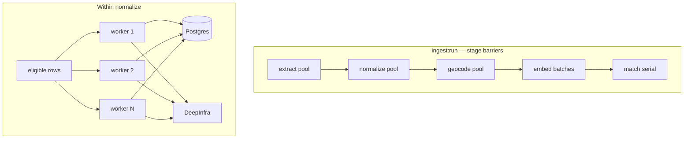

# Plan: Concurrent POI Ingest Stages

> Status: proposed architecture and implementation checklist.
>
> Scope: keep the ingest pipeline linear by stage (extract → normalize → geocode →
> embed → match → …), but process multiple independent records concurrently within each
> stage so network wait time overlaps. Order of records within a stage does not matter.
>
> Companion designs:
> - `.cursor/plans/poi-ingestion-orchestration.md` — file-first `ingest:run`, artifacts,
>   resume, budgets.
> - `.cursor/plans/poi-llm-normalization.md` — one-record DeepSeek requests, claim/lease
>   sketch, `--concurrency` CLI (defaults were `1`; this plan raises production defaults
>   and implements the worker pool).

---

## 1. Problem

The live pipeline is I/O-bound and strictly serial:

| Stage | Current loop | Typical wait per item |
| ----- | ------------ | --------------------- |
| extract | `for await` → one Postgres txn | ~1s remote RTT |
| normalize | `for (row of rows)` → one DeepInfra call | ~30s LLM |
| geocode | serial + 1s throttle | LocationIQ rate limit |
| embed | API batches of 32, batches serial | Jina |
| match | serial claim loop | DB + occasional LLM |

At ~50k records, normalize alone is on the order of weeks if every row is a cache miss.
Almost all of that time is waiting on the network, not local CPU. The Postgres pool
(`PG_POOL_MAX`, default 10) already supports multiple connections; the application never
uses more than one at a time inside a stage.

**Non-goals for this plan:**

- Do not pipeline stages across records (no “normalize N while extracting N+1”).
- Do not batch multiple POIs into one DeepSeek prompt (accuracy contract stays one record
  per request).
- Do not parallelize match/consolidate in the first cut (shared cluster mutation).
- Do not introduce Redis/queues/workers as separate processes unless single-process
  concurrency proves insufficient.

---

## 2. Design rule

**Linear by stage, concurrent within stage.**

```
extract (pool) → normalize (pool) → geocode (rate-limited pool) → embed → match (serial)
```

Why stage barriers stay:

- Resume and reporting already key off DB artifacts / stage state.
- Downstream stages select work by SQL (`normalization_state`, `lat IS NULL`, etc.).
- A failed stage does not leave half-normalized rows mixed with half-extracted ones in a
  confusing cross-stage way.
- Orchestrator heartbeats and `--stop-after` remain simple.

Why concurrency inside a stage is safe:

- Each record has a stable identity (`source_record_id` / `research_pois.id`).
- Successful work is versioned artifacts; unfinished work stays pending/retryable.
- Record order does not matter as long as each item’s stage outcome is recorded.



---

## 3. Shared primitive: `mapPool`

Add `lib/db-map/scripts/ingest/concurrency.ts` (name flexible) with a small, dependency-free
worker pool.

### 3.1 API

```ts
export interface MapPoolOptions {
  concurrency: number;
  /** Called when a worker finishes (success or failure). */
  onSettled?: (info: { index: number; ok: boolean }) => void;
  /** If true, stop claiming new items (in-flight still finish). */
  shouldStop?: () => boolean;
}

export async function mapPool<T, R>(
  items: AsyncIterable<T> | Iterable<T>,
  concurrency: number,
  worker: (item: T, index: number) => Promise<R>,
  opts?: Omit<MapPoolOptions, "concurrency">,
): Promise<{ results: Array<R | undefined>; errors: Array<{ index: number; error: unknown }> }>;
```

### 3.2 Semantics

1. Cap in-flight work at `concurrency` (clamp to ≥ 1).
2. As soon as one worker settles, start the next pending item.
3. Worker exceptions are caught per item — one failure does not abort the pool unless the
   caller rethrows for fatal errors (DB down, auth missing).
4. `shouldStop()` is checked before claiming the next item (Ctrl-C, budget exhausted).
5. On stop: do not claim new work; `await` all in-flight workers; return.
6. Completion order is undefined; callers must not assume `results[i]` finished before
   `results[i+1]`.
7. For `AsyncIterable` sources (extract file stream): pull the next record only when a
   worker slot opens, so memory stays bounded. Do **not** materialize the whole file into
   an array first for 50k+ CSV/JSONL.

### 3.3 What not to build

- No priority queues.
- No cross-process coordination in v1.
- No automatic retry inside `mapPool` — stages already own retry/error classification.

### 3.4 Smoke test

A tiny node script or vitest (if the package already has tests) that:

- runs 20 fake tasks with `delay(50)` at concurrency 4;
- asserts max in-flight ≤ 4;
- asserts a thrown worker error is isolated;
- asserts `shouldStop` prevents further claims after N completions.

---

## 4. Configuration and CLI

### 4.1 `ingestConfig` additions (`scripts/ingest/config.ts`)

```ts
concurrency: {
  extract: envNumber("INGEST_EXTRACT_CONCURRENCY", 16),
  normalize: envNumber("INGEST_NORMALIZE_CONCURRENCY", 8),
  geocode: envNumber("INGEST_GEOCODE_CONCURRENCY", 1),
  embedBatches: envNumber("INGEST_EMBED_BATCH_CONCURRENCY", 1),
},
```

Defaults rationale:

- **extract 16**: DB-bound; pool must be sized accordingly.
- **normalize 8**: large latency win; DeepInfra may 429 — tunable down.
- **geocode 1**: LocationIQ free tier ~2 req/s; keep serial until a shared rate limiter
  exists (see §7).
- **embedBatches 1**: already batches texts; multi-batch is optional follow-up.

### 4.2 CLI flags

Wire through `run.ts` → `OrchestratorOptions` → stages, and through standalone stage CLIs
(`normalize.ts`, `extract` path in orchestrator, later geocode/embed).

```bash
# Global default applied to stages that support it (normalize primary).
pnpm --filter @lib/db-map ingest:run <file> --category <slug> --concurrency 8

# Per-stage overrides (win over --concurrency / env defaults).
--extract-concurrency 16
--normalize-concurrency 8
--geocode-concurrency 1
--embed-batch-concurrency 2
```

Also on standalone:

```bash
pnpm --filter @lib/db-map ingest:normalize --source <slug> --concurrency 8
```

Precedence (highest wins):

1. Explicit per-stage CLI flag
2. `--concurrency` (applies to normalize; optionally also extract if no extract override)
3. Env / `ingestConfig` default

Document in `lib/db-map/README.md` under Useful controls.

### 4.3 Postgres pool sizing

`getDb()` uses `PG_POOL_MAX` (default 10). Concurrent extract + normalize need more.

**Rule of thumb for an ingest shell:**

```text
PG_POOL_MAX >= extractConcurrency + normalizeConcurrency + 4
```

Example: extract 16 + normalize 8 + headroom 4 → `PG_POOL_MAX=28`.

Document this next to the concurrency flags. Optionally log a warning at run start if
`extractConcurrency + 2 > PG_POOL_MAX` (connection wait / timeout risk).

Do **not** silently raise the pool in code without documenting it — operators may share the
DB with the app.

---

## 5. Extract concurrency

### 5.1 Current shape

`orchestrator.extractFile`:

- streams records via `recordsFor`;
- assigns `ordinal++`;
- `upsertRunRecord`;
- `db.connect()` → BEGIN → `observeRecord` (row `FOR UPDATE`) → update run record → COMMIT.

Work is already per-record isolated.

### 5.2 Changes

1. Refactor the body of the loop into `processExtractRecord(...)`.
2. Drive with `mapPool` over the async iterable (or a thin adapter that yields
   `{ ordinal, record }` with ordinals assigned on pull).
3. Default concurrency from config / `--extract-concurrency`.

### 5.3 Ordinal assignment (gotcha)

`source_ordinal` must remain stable for a given file parse order (resume / ledger).

**Do not** assign ordinals inside concurrent workers (race → duplicate/skipped ordinals).

Correct pattern:

```ts
let nextOrdinal = 0;
async function* withOrdinals(records: AsyncIterable<RawRecord>) {
  for await (const record of records) {
    nextOrdinal += 1; // sync increment on the single consumer that feeds the pool
    yield { ordinal: nextOrdinal, record };
  }
}
```

`mapPool` must pull from the async generator on the main scheduler only when a slot frees —
so ordinal assignment stays single-threaded even though workers run concurrently.

### 5.4 `--limit`

Stop claiming new records once `seen >= limit`. In-flight records may push `seen` slightly
over if counted at claim time — prefer counting at claim (when ordinal is assigned) and
stop pulling from the generator when `nextOrdinal` would exceed limit.

### 5.5 Snapshot retirement

`retireMissingSnapshotRows` must run **after** the extract pool fully drains, never
concurrently with extract workers (it locks research rows and compares run-record
membership).

### 5.6 Logging

Interleaved `extract ok #N …` lines are acceptable. Keep ordinal + `source_record_id` in
the line so humans can grep.

### 5.7 Expected speedup

~1s serial → ~1s / concurrency (minus pool contention). 50k × 1s ≈ 14h → ~1h at
concurrency 16, if the DB keeps up.

---

## 6. Normalize concurrency (primary win)

### 6.1 Current shape

`runHybridNormalize`:

1. `fetchRows` — loads **all** eligible rows into memory.
2. Serial `for` loop: cache check → budget check → `callNormalizer` → resolve → activate.
3. Shared `stats` object mutated in place.

### 6.2 Changes

1. Extract loop body → `processNormalizeRow(db, row, ctx): Promise<RowOutcome>`.
2. `await mapPool(rows, concurrency, processNormalizeRow, { shouldStop })`.
3. Aggregate stats from outcomes (or atomic counters — see §6.4).
4. Pass `concurrency` from orchestrator / CLI / config.
5. Keep **one record per DeepInfra request**.

### 6.3 Memory gotcha: `fetchRows`

Today normalize selects every non-retired row for the source with no `LIMIT` in SQL
(limit is applied in the JS loop). At 50k+ rows with large `raw` JSON this can be heavy.

**v1 (acceptable):** keep `fetchRows` as-is if memory is fine for current corpora; apply
`--limit` in SQL when set.

**v1.1 (recommended soon after):** page work in chunks:

```sql
... ORDER BY rp.first_seen_at, rp.id
LIMIT $pageSize OFFSET ...
-- or keyset: (first_seen_at, id) > ($lastSeen, $lastId)
```

Or claim via `FOR UPDATE SKIP LOCKED` (§6.6). Do not block the concurrency PR on full
leasing, but do add SQL `LIMIT` when `--limit` is set.

### 6.4 Shared stats and budgets (critical)

`stats.llmRequests`, `stats.costUsd`, `stats.processed`, etc. are mutated from many
workers.

**Rules:**

- Use simple atomic increments (JS is single-threaded; `stats.llmRequests += 1` after await
  is fine **if** the increment happens in the worker after the call, not in a torn
  read-modify across awaits without care).
- **Budget reservation must happen before the LLM call**, synchronously relative to other
  workers’ reservation:

```ts
function tryReserveLlmRequest(stats, opts): boolean {
  if (opts.maxRequests !== undefined && stats.llmRequests >= opts.maxRequests) return false;
  if (opts.maxCostUsd !== undefined && stats.costUsd >= opts.maxCostUsd) return false;
  // Optimistically count the request now so concurrent workers see it.
  stats.llmRequests += 1;
  return true;
}
```

After the call, add actual `costUsd`. If the call fails before a billable response, decide
whether to decrement the request counter (prefer: keep the count — budget is a ceiling on
attempts, not only successes).

When reservation fails: mark job `retryable` / set `stoppedByBudget`, set
`shouldStop = true`, do not start new LLM calls. **In-flight reserved calls finish.**

**Gotcha:** with concurrency 8, up to 7 extra LLM calls can already be in flight when the
Nth reservation hits the budget. Document that `--max-llm-requests 100` means
“approximately 100”, with overshoot ≤ concurrency−1. Optionally reserve slots up front
(`remaining = maxRequests - inFlight`) more strictly — nice-to-have.

### 6.5 Cache hits vs LLM path

Cache hits are fast and DB-only. Prefer not to let a flood of cache hits starve LLM
workers — usually fine with one pool. Optional later: two pools (cache-only high
concurrency, LLM low concurrency). Skip for v1.

### 6.6 Claim / lease (optional, multi-process)

The normalization plan already specifies DB leases + `FOR UPDATE SKIP LOCKED`.

**v1 single-process:** worker pool alone is enough; no lease table required.

**v2 (if two terminals run normalize on the same source):** implement claim tokens so two
processes do not normalize the same row. Completion must require the claim token so a
stale worker cannot overwrite a newer activation.

Do not block v1 on leases, but keep activation transactional and keyed by `input_hash` so
duplicate work is mostly idempotent even without leases.

### 6.7 Activation races

Two workers must never process the **same** `research_pois.id` concurrently in v1 (disjoint
row lists from one `fetchRows`). If paging/claiming is added later, the claim step is what
prevents double processing.

Activation already swaps `active_normalization_id` in a transaction — keep that. Do not
hold that transaction across `completeChat`.

### 6.8 Ctrl-C

Match existing ingest UX:

1. First signal: set `shouldStop`, finish in-flight normalize rows, print resume command,
   exit code 2 if partial.
2. Second signal: hard exit (optional; document if implemented).

Wire `process.on("SIGINT" | "SIGTERM")` in `runHybridNormalize` / orchestrator if not
already present for normalize (match already has shutdown handling).

### 6.9 Expected speedup

~30s serial → ~30s / concurrency for cache misses. 50k × 30s ≈ 17 days → ~2 days at
concurrency 8, before accounting for cache hits and 429 backoff.

---

## 7. Geocode concurrency (rate-limited)

### 7.1 Constraint

LocationIQ free tier is roughly 2 req/s. Current code uses `throttleMs` default 1000 and
serial calls. Blind concurrency will trigger 429s and abort.

### 7.2 Approach

**v1:** leave geocode at concurrency 1 (default). No behavior change.

**v1.1:** shared token-bucket / min-interval gate:

```ts
const gate = createRateGate({ minIntervalMs: opts.throttleMs });
// inside worker, before API call:
await gate.acquire();
await geocode(...);
```

Then `--geocode-concurrency 4` only overlaps **cache lookups and DB writes**; API calls
still serialize through the gate (or allow burst ≤ 2/s).

Cache hits and known misses should **not** take a rate-limit token.

### 7.3 Cache write races

Two workers geocoding the same normalized query string could double-call the API.

Mitigations:

- Prefer serial API path via the gate (same query rarely concurrent if rows differ).
- `research_geocode_cache` upsert should be idempotent (`ON CONFLICT`); last writer wins
  with same payload is fine.
- Optional: in-process `Map` of in-flight query promises (coalesce duplicate queries).

---

## 8. Embed concurrency

Already batches up to `EMBED_BATCH_SIZE` (32) texts per Jina request.

**v1:** no change required.

**Follow-up:**

- `--embed-batch-concurrency 2` — two batch HTTP calls in flight.
- Parallelize per-row DB writes after vectors return (`mapPool` over the batch results).
- On mis-sized provider response, split batch and retry individuals (already noted in
  orchestration plan).

---

## 9. Match — explicitly deferred

Matching updates shared canonical membership and consolidation state. Parallel workers
risk:

- two research rows attaching to related clusters concurrently;
- duplicate canonical creates;
- consolidation seeing half-updated graphs.

Keep match serial until normalize/extract are concurrent and match is the measured
bottleneck. If revisited: claim pending research rows with `SKIP LOCKED` and partition by
blocking key (coarse geo/name), never two workers on overlapping candidate sets.

---

## 10. Orchestrator integration

`runOrchestration` already runs stages sequentially. Changes:

1. Extend `OrchestratorOptions` with concurrency fields.
2. Pass normalize concurrency into `runHybridNormalize`.
3. Pass extract concurrency into `extractFile`.
4. Include concurrency in `research_ingest_runs.options` JSON (already stores `opts`) and
   in `resumeCommand()` so resume preserves throughput settings.
5. Log at stage start: `Normalize: concurrency=8 poolMax=28`.

Standalone stage commands spawned via `runCommand` (`ingest:geocode`, etc.) need flags
forwarded when those stages gain concurrency.

---

## 11. Provider / error handling gotchas

| Issue | Handling |
| ----- | -------- |
| DeepInfra 429 / 5xx | Existing `completeChat` retries; if sustained 429, log and consider lowering concurrency; do not crash the whole pool on one row |
| DeepInfra timeout (180s) | One worker blocked; others continue; row marked failed/retryable |
| Postgres `connectionTimeoutMillis` | Symptom of undersized `PG_POOL_MAX`; warn at startup; treat as fatal if systemic |
| `FOR UPDATE` lock wait on same POI | Should not happen across disjoint records; if re-extract same id from two ordinals (bad source data), second waits — timeout possible |
| Interleaved logs | Accept; always include record id |
| Cost overshoot | Document ≤ concurrency−1 extra LLM calls past `--max-llm-requests` |
| Partial file extract + normalize | Unchanged: normalize selects DB rows for source, not only this run’s ordinals — be aware `--limit` on extract then normalize may normalize older pending rows too unless normalize is scoped by run (check current behavior; if normalize is source-wide, document it) |

### 11.1 Normalize scope vs `--limit` (important)

Today `runHybridNormalize` with `source` + `limit` processes the first N eligible rows for
that source (ordered by `first_seen_at`), not necessarily “the N rows just extracted in
this run.” That is pre-existing. Concurrency does not change it, but operators running
pilots should know:

- `--limit 20` on `ingest:run` limits extract count **and** passes limit into normalize;
- normalize’s N may include previously pending rows from the same source.

Optional improvement (separate from concurrency): scope normalize to `run_id` via
`research_ingest_run_records` / observation ids from this run. Track as follow-up if pilots
are confusing.

---

## 12. Implementation checklist

### Phase A — foundation (ship first)

- [ ] Add `scripts/ingest/concurrency.ts` with `mapPool` + `shouldStop` support.
- [ ] Add smoke test / small self-check script for pool invariants.
- [ ] Add `ingestConfig.concurrency.*` env defaults.
- [ ] Extend `OrchestratorOptions` + `run.ts` arg parsing for `--concurrency` and
      per-stage overrides.
- [ ] Document flags + `PG_POOL_MAX` guidance in `lib/db-map/README.md`.
- [ ] Include concurrency in resume command string.

### Phase B — extract

- [ ] Refactor `extractFile` loop body to `processExtractRecord`.
- [ ] Feed `{ ordinal, record }` through `mapPool` with sync ordinal assignment.
- [ ] Honor `--limit` at claim time; drain in-flight on stop.
- [ ] Keep snapshot retirement strictly after pool drain.
- [ ] Manual check: re-run a small JSON file at concurrency 8; compare counts to serial
      run (seen/inserted/unchanged/failed).

### Phase C — normalize

- [ ] Refactor `runHybridNormalize` loop body to `processNormalizeRow`.
- [ ] Drive with `mapPool`; default concurrency 8.
- [ ] Implement budget reservation before LLM calls; set stop on budget.
- [ ] Apply SQL `LIMIT` when `--limit` is set.
- [ ] SIGINT: stop claiming, drain in-flight, print resume command.
- [ ] Manual check: `--limit 20 --concurrency 4` vs `--concurrency 1` — same accepted
      count, lower wall time; spot-check a few `research_poi_normalizations` rows.
- [ ] Manual check: `--max-llm-requests 5 --concurrency 4` stops with overshoot ≤ 3.

### Phase D — polish (optional same PR or follow-up)

- [ ] Startup warning if concurrency sum exceeds `PG_POOL_MAX`.
- [ ] Geocode rate gate + optional concurrency > 1.
- [ ] Embed multi-batch concurrency.
- [ ] Keyset/paging or `SKIP LOCKED` claim for normalize at large scale.
- [ ] Scope normalize to current `runId` when provided (pilot clarity).

### Phase E — explicitly out of scope

- [ ] Parallel match / consolidate.
- [ ] Multi-record LLM prompts.
- [ ] Cross-stage record pipelining.
- [ ] External job queue infrastructure.

---

## 13. Verification plan

1. **Correctness (small file):**
   - Run `ingest:run` on a ≤50 record file with `--concurrency 1` and `--concurrency 8`.
   - Diff extract counters and normalize accepted/rejected/failed (allow log order
     differences only).
2. **Idempotency:**
   - Re-run same file/version; extract should be mostly `unchanged`; normalize mostly
     cache hits; wall time should collapse.
3. **Budget:**
   - `--max-llm-requests 3 --normalize-concurrency 4`; confirm stop + resume command;
     confirm request count in DB ≈ 3..6.
4. **Failure isolation:**
   - Temporarily break one record (if feasible) or mock; confirm other workers continue.
5. **Pool pressure:**
   - Run extract concurrency 16 with `PG_POOL_MAX=10`; confirm warning or connection
     timeouts; then raise pool and re-run cleanly.
6. **Large pilot:**
   - `--limit 200 --normalize-concurrency 8` on a real source; compare throughput
     (records/min) to concurrency 1.

---

## 14. Rollout recommendation

1. Land Phase A+B+C in one PR if small; otherwise A+B then C.
2. Default normalize concurrency to **8** in config (not 1). Operators who want the old
   behavior use `--concurrency 1`.
3. Keep geocode at 1 until rate gate exists.
4. After merge, update `.cursor/plans/poi-ingestion-unfinished-work.md` to note concurrency
   as done / remaining follow-ups (paging, geocode gate, run-scoped normalize).

---

## 15. Success criteria

- Extract and normalize remain logically “one record at a time” in code structure
  (`processOne`), with concurrency only at the scheduler layer.
- Wall-clock normalize throughput scales roughly with concurrency until the provider or DB
  saturates (target: ≥4× faster at concurrency 8 on LLM-bound workloads).
- Resume, budgets, `--limit`, `--retry-failed`, and `--shadow` keep working.
- No increase in duplicate active normalizations or lost extract ledger rows under
  concurrent load.
- Docs state how to set concurrency and `PG_POOL_MAX` for large imports (e.g. The Dyrt
  ~44k rows).
