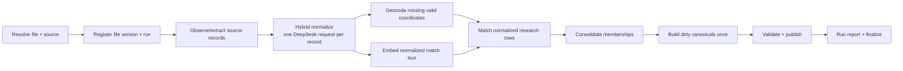

# Plan: End-to-End POI Ingestion Orchestration

> Status: proposed architecture and implementation checklist.
>
> Scope: one developer command takes a registered JSON/JSONL/CSV file under `docs/poi/`
> through structural extraction, immutable research observation, hybrid deterministic +
> DeepSeek normalization, geocoding, embedding, matching, consolidation, and stable
> canonical build.
>
> Companion design: `.cursor/plans/poi-llm-normalization.md` defines the normalization
> contract, deterministic/LLM authority rules, one-record requests, and validation.

## 1. Developer experience

The primary command is file-first:

```bash
pnpm --filter @lib/db-map ingest:run \
  docs/poi/music-festivals/directories/musicfestivalwizard_festivals.json
```

The developer supplies only the source file in the normal case. The command:

1. resolves the file to exactly one registered source and category;
2. validates the source profile, taxonomy, extractor, and required credentials;
3. computes the file and pipeline fingerprints;
4. resumes a compatible incomplete run or creates a new run;
5. skips artifacts already complete for the same input/version;
6. processes missing or stale work in stage order;
7. records every success, rejection, retry, failure, and active artifact in PostgreSQL;
8. prints progress, budgets, failures, and the exact resume command;
9. ends with a reconciliation report scoped to this file/run.

Useful modes:

```bash
# Explain source resolution and intended work; no writes or provider calls.
pnpm --filter @lib/db-map ingest:run <file> --dry-run

# Process at most 20 new records per stage; useful for a pilot.
pnpm --filter @lib/db-map ingest:run <file> --limit 20

# Stop after normalization, retaining resumable state.
pnpm --filter @lib/db-map ingest:run <file> --stop-after normalize

# Retry failed/retryable work without repeating successful artifacts.
pnpm --filter @lib/db-map ingest:run <file> --retry-failed

# Re-run selected logic even when its version/input cache says complete.
pnpm --filter @lib/db-map ingest:run <file> --reprocess normalize

# Re-run a stage and all required descendants.
pnpm --filter @lib/db-map ingest:run <file> --from normalize

# Evaluate a new normalizer without activating it downstream.
pnpm --filter @lib/db-map ingest:run <file> --from normalize --shadow

# Bound external work.
pnpm --filter @lib/db-map ingest:run <file> \
  --max-llm-requests 100 --max-cost-usd 1 --geocode-limit 500
```

`--reprocess` and `--from` never mean destructive full reclustering. Full recluster remains
a separate, explicitly approved operation.

## 2. Core design rule: artifacts, not processed booleans

Do not represent pipeline completion with one `processed=true` flag. A record is complete
for a stage only when the database contains a successful artifact matching:

- the exact source observation/input fingerprint;
- the stage implementation/version;
- the relevant policy/profile/prompt/schema/model versions;
- the upstream artifact fingerprints consumed by that stage.

Examples:

- the same file bytes + same extractor version = no extraction work;
- the same observation + same normalizer input hash = no DeepSeek call;
- a prompt/example/profile change = normalization is stale even if the raw file is unchanged;
- a description-only normalization change = canonical rebuild may be needed, but geocode,
  embedding, and match may remain current;
- an embedding-model change = re-embed and potentially rematch, but do not re-extract,
  re-normalize, or re-geocode;
- a canonical-builder change = rebuild affected canonicals without rematching research rows.

Operational job rows help resume work, but successful versioned artifacts are the durable
truth. Deleting a job row must never make successful work appear undone.

## 3. Source/file registration

### 3.1 Extend the source registry

Each source definition must declare the files it owns:

```ts
{
  meta: {
    slug: "musicfestivalwizard",
    name: "Music Festival Wizard",
    trust: 65,
  },
  files: [
    {
      pattern:
        "docs/poi/music-festivals/directories/musicfestivalwizard_festivals.json",
      category: "music_festival",
      mode: "snapshot",
      format: "json",
      extractor: "generic",
    },
  ],
  normalizationProfile: "musicfestivalwizard-v1",
}
```

Required file metadata:

- repo-relative path/glob;
- canonical category slug;
- file mode: `snapshot` or `incremental`;
- format and structural extractor;
- extractor version;
- normalization/source profile;
- whether stable ids are source-provided or deterministically synthesized;
- optional expected wrapper path such as `festivals`, `events`, or `elements`;
- optional expected minimum/maximum record count to catch accidental empty/truncated files.

### 3.2 Resolution rules

Given one file path:

1. Resolve it to an absolute path and require it to remain under `docs/poi/`.
2. Normalize to a repo-relative logical path.
3. Match registered file patterns.
4. Fail before writes if zero or multiple source definitions match.
5. Validate the category exists in the code-owned taxonomy.
6. Validate the extension and wrapper shape against the registered extractor.
7. Refuse an empty or unexpectedly small snapshot unless `--allow-count-anomaly` is explicit.

`--source` and `--category` may exist as diagnostic overrides, but they should not be needed
for registered files and must never silently override a conflicting registry declaration.

### 3.3 Snapshot vs incremental semantics

- `snapshot`: the file is the current complete source snapshot. After a fully successful
  extraction pass, previously active source records absent from the new snapshot become
  retired.
- `incremental`: the file contributes observations but absence never retires an older
  source record.

Never retire absent records after a limited, interrupted, or partially failed extraction.

## 4. End-to-end stage graph



Use stage sweeps, not one record all the way to canonical before reading the next file
record:

1. complete the source observation pass;
2. normalize eligible observations sequentially;
3. geocode accepted POIs missing valid coordinates;
4. embed accepted normalized records;
5. match all ready records;
6. consolidate after membership is stable;
7. rebuild each dirty canonical once;
8. report and finalize.

Stage sweeps make snapshot deletion safe, give matching a complete source cohort, and avoid
rebuilding/synthesizing the same canonical after every attached row.

## 5. Database execution model

### 5.1 `research_source_files`

One logical row per registered source file:

- id, source id, logical repo-relative path;
- declared category, mode, format, extractor id;
- current active file-version id;
- first/last seen timestamps;
- uniqueness on logical path.

### 5.2 `research_source_file_versions`

One immutable row per distinct file content and extractor version:

- source-file id;
- streaming SHA-256, byte size, optional record count;
- extractor id/version and registry/profile version;
- observed filesystem metadata for diagnostics only;
- status: `pending | extracting | complete | partial | failed`;
- created/completed timestamps;
- uniqueness on `(source_file_id, file_sha256, extractor_version)`.

Filesystem modification time is not an identity signal. File bytes and extractor version are.

### 5.3 `research_ingest_runs`

One top-level execution:

- run id, source-file version, source/category;
- requested mode: resume, reprocess stage, from stage, shadow;
- pipeline version manifest;
- budgets and limits;
- status:
  `planned | running | paused | waiting_budget | partial | succeeded | failed | cancelled`;
- resumed-from run id;
- stage/counter summaries;
- started, heartbeat, stopped, completed timestamps;
- fatal error and exact resume command.

If the same file version and desired pipeline manifest has a resumable run, default behavior
is to resume it. A completed compatible run produces a no-op plan.

### 5.4 `research_ingest_run_records`

One row per parsed source record in a run/file version:

- run id and source-file version;
- source record id when available;
- source ordinal/path for diagnostics;
- redacted raw hash;
- research POI and observation ids when written;
- extract state:
  `pending | written | unchanged | rejected | failed`;
- attempts, last error class/message, retry time;
- first/last attempt timestamps.

Insert or claim this lightweight ledger entry before writing `research_pois`. This is how
record-level research write failures remain visible even when the research row was never
created.

If PostgreSQL itself is unavailable, stop the run. The immutable source file remains the
durable queue; restarting re-parses it, and existing run-record/research rows make successful
records cheap no-ops.

### 5.5 `research_pipeline_jobs`

A generic operational ledger for stages after observation:

- run id;
- target kind/id (`observation`, `normalization`, `research_poi`, or `canonical_poi`);
- stage: `normalize | geocode | embed | match | consolidate | canonical_build`;
- desired input hash and stage version;
- status:
  `pending | leased | succeeded | retryable | quarantined | failed | cancelled`;
- claim token, lease owner, lease expiry;
- attempts, next retry, error class/message/details;
- output artifact id;
- timestamps;
- uniqueness on `(target_kind, target_id, stage, desired_input_hash)`.

Claim jobs with `FOR UPDATE SKIP LOCKED`, commit the lease before external work, and require
the claim token when completing the job. External calls never run inside a database
transaction.

### 5.6 Membership and canonical history

Add versioned membership history rather than relying only on
`research_pois.canonical_poi_id`:

`research_canonical_memberships`

- research POI id and active normalization id;
- canonical POI id;
- matcher version and match-decision id;
- active flag, assigned/retired timestamps;
- retirement/reassignment reason.

Keep `research_pois.canonical_poi_id` as a compatibility/current pointer during migration.

For canonicals:

- `canonical_pois` is the stable identity;
- `canonical_poi_builds` stores versioned field selections/synthesis and provenance;
- `canonical_pois.active_build_id` points to the active user-facing build;
- `canonical_poi_redirects` maps merged-away ids to the deterministic survivor.

This lets pipeline logic change without unnecessarily changing public canonical ids.

## 6. Stage 0 — Preflight and planning

Before any writes or provider calls:

1. Resolve and validate the source file.
2. Stream-hash it without loading it into memory.
3. Resolve source/category/extractor/profile versions.
4. Load the desired pipeline version manifest.
5. Compare the file version and artifact fingerprints in PostgreSQL.
6. Print:
   - source, category, file mode, path, bytes, SHA prefix;
   - extractor/normalizer/geocoder/embedding/matcher/builder versions;
   - compatible prior run;
   - counts current, stale, failed, quarantined, and not yet observed;
   - planned provider calls and configured budgets;
   - stages that will be skipped;
   - exact resume command.

`--dry-run` stops after this plan. For a new file, it may stream/parse records and query the
database, but it makes no database writes or external calls.

## 7. Stage 1 — Structural extraction and observation

### 7.1 Responsibilities

Structural extractors do only what is required before semantic normalization:

- stream JSON arrays, JSONL, CSV, or registered wrapper arrays;
- flatten enough structure to obtain a stable source record id and captured envelope;
- redact acquisition credentials;
- preserve the complete POI source object in an immutable observation;
- emit source validity hints and strong ids without interpreting ambiguous prose.

Do not use DeepSeek to unwrap a file or invent stable ids.

### 7.2 Per-record transaction flow

For each parsed record:

1. Determine `source_record_id`. If missing, apply only a registered deterministic id
   strategy; never use array position as identity.
2. Upsert/claim `research_ingest_run_records` in its own short transaction.
3. Deep-canonicalize and hash the redacted POI raw object.
4. Upsert the stable `research_pois` identity by `(source_id, source_record_id)`.
5. Insert/reuse the immutable observation by `(research_poi_id, raw_content_hash)`.
6. Link the run record to the research row/observation.
7. If unchanged, retain active normalization/membership and mark `unchanged`.
8. If changed, set normalization refresh pending while keeping the old active projection
   available until a replacement succeeds.
9. Commit.

### 7.3 Write failures

Classify failures:

- transient DB connection/deadlock/serialization: retry with backoff, then pause the run if
  database health is lost;
- permanent record constraint/data error: update the run-record ledger to `failed`, store a
  redacted error and source ordinal/id, continue to the next record;
- missing/unstable id: `rejected` with a specific reason;
- file parser/structural error: fail the extraction pass and do not finalize snapshot
  absence/retirement.

At end of a complete snapshot pass:

1. verify parsed/written/rejected/failed counts;
2. require zero unresolved extraction failures before absence finalization;
3. mark source records not seen in this complete version as retired;
4. schedule removal/rebuild work for their canonical memberships;
5. activate the file version.

## 8. Stage 2 — Hybrid normalization

Use the exact design in `poi-llm-normalization.md`:

1. deterministic parser builds validated facts/candidate ids;
2. select two reviewed source/category few-shot conversations;
3. call DeepSeek with exactly one real research observation;
4. schema-validate the single response;
5. resolve each field using deterministic authority rules;
6. allow one repair request for semantic/schema failures;
7. persist request, proposal, resolved values, evidence, warnings, and versions;
8. activate accepted output transactionally;
9. quarantine persistent failures without hiding a prior valid active normalization.

### Eligibility

- Explicit hard non-POI source records may be deterministically rejected without an LLM
  call when the source policy proves the exclusion.
- All other new/stale eligible observations receive one DeepSeek request unless cached.
- `is_poi=false` from a successful classification is a successful normalization outcome,
  not a pipeline failure.

### Resume and reprocessing

Default selection is observations whose desired normalization input hash has no successful
artifact. A changed prompt/schema/example/profile/model automatically creates stale work.

`--reprocess normalize` bypasses the successful cache for this run, records
`forced_by_run_id`, and evaluates a fresh attempt. It does not replace the active
normalization unless the new resolved output passes all activation rules.

## 9. Stage 3 — Geocoding

Select accepted active normalized POIs that:

- are real POIs;
- have no validated source/URL coordinates;
- have a usable normalized geocode query;
- lack a successful geocode artifact for the desired query/provider/version.

Process:

1. Build ranked queries from venue/address/city/region/country.
2. Check `research_geocode_cache`.
3. Call the provider only on cache miss.
4. Validate country/locality consistency.
5. Store a versioned `research_poi_geocodes` artifact.
6. Activate it only when valid.
7. Record misses and provider failures distinctly.

Daily budget exhaustion sets the run to `waiting_budget`, leaves jobs pending, and prints the
same resume command. It is not a failed import.

Source/URL coordinates always outrank LLM-extracted locality plus geocoding. DeepSeek never
returns coordinates.

## 10. Stage 4 — Embeddings

Select active normalizations missing the desired embedding input/model artifact.

The embedding input is a deterministic string from:

- match/series name;
- aliases;
- venue/city/region/country;
- allowed category slugs.

Embedding requests may use small provider batches because they are non-generative and
deterministically mapped by id. Persist each returned vector separately. On a failed or
mis-sized response, split the batch and retry individual records.

Description-only changes do not re-embed when the embedding input hash is unchanged.

## 11. Stage 5 — Matching and membership

### 11.1 Ready input

A row is match-ready when it has:

- active accepted/degraded normalization allowed for matching;
- `is_poi=true`;
- normalized match/series name;
- allowed categories;
- validated coordinates;
- desired embedding when configured as required, or an explicit no-embedding fallback.

### 11.2 Decision flow

For each match-ready normalization without current membership for the desired matcher
version:

1. apply manual overrides;
2. find strong-id candidates;
3. generate category/location/name candidates;
4. score deterministic signals;
5. auto-merge only above strict thresholds;
6. auto-create only below strict thresholds;
7. ask the match LLM for one ambiguous pair at a time;
8. persist the decision and signals;
9. assign a versioned membership in one transaction;
10. mark affected canonical ids dirty; do not synthesize/rebuild them yet.

Match jobs are per research normalization and transactional. A crash rolls back only the
current membership.

### 11.3 Reprocessing matcher logic

A matcher-version change or `--reprocess match` creates desired jobs for affected active
normalizations. Re-evaluate them individually:

- preserve membership when the new decision agrees;
- when moving a row, retire the old membership, assign the new one, and dirty both
  canonicals;
- rebuild the old canonical so removed source fields do not remain;
- never delete all canonicals as an implicit reprocess step.

## 12. Stage 6 — Consolidation

After all ready rows in this file/run have membership:

1. consolidate deterministic satellite/anchor cases;
2. use memoized LLM adjudication only for ambiguous anchor pairs;
3. key decisions by canonical member/build fingerprints plus matcher/prompt version;
4. choose a deterministic surviving canonical id;
5. move memberships transactionally;
6. insert `canonical_poi_redirects` for merged-away ids;
7. dirty the survivor and any affected prior canonicals.

Run consolidation until no changes or a bounded iteration limit. It is resumable by pair
fingerprint.

## 13. Stage 7 — Canonical build

Build each dirty canonical once after membership/consolidation stabilizes.

### 13.1 Deterministic candidate preparation

From active member normalizations:

- collect field candidates with source trust, recency, confidence, evidence, and
  corroboration;
- elect source/URL/geocoder coordinate candidates deterministically;
- aggregate all validated occurrences;
- collect typed attributes without last-write-wins loss;
- compute canonical-build fingerprint.

### 13.2 Canonical synthesis

For single-source/non-conflicting clusters, build deterministically from the accepted
normalization.

For multi-source or conflicting clusters:

1. send one canonical cluster per DeepSeek request with reviewed canonical examples;
2. require candidate ids for selected scalar fields;
3. allow description synthesis only from cited normalized facts;
4. validate all selections and generated claims;
5. flag possible cluster contamination but do not auto-split it;
6. persist a versioned `canonical_poi_builds` row.

### 13.3 Activation and publication

Activate the build transactionally and materialize current fields into `canonical_pois` for
the app.

Publish only when category policy and quality gates pass. Otherwise keep a stable canonical
identity with an active `draft`/`hidden` build and explicit reasons.

An unchanged build fingerprint makes zero LLM calls and no user-facing update.

## 14. Stage 8 — Reporting and run completion

At the end, print and persist:

- file version and pipeline manifest;
- records parsed, unchanged, inserted, changed, retired, rejected, and failed;
- normalization cache hits, DeepSeek requests, repaired, quarantined, invalid/non-POI;
- geocode cache hits, calls, misses, budget state, and failures;
- embeddings created/cache hits/failures;
- match decisions by method, memberships created/moved/unchanged;
- canonical merges, redirects, builds, published/draft/hidden;
- provider tokens, estimated cost, and latency;
- unresolved/retryable failures grouped by stage/error;
- exact commands for resume, retry failures, and inspect report.

Run terminal states:

- `succeeded`: every planned job is successful or an expected semantic rejection;
- `partial`: permanent/quarantined record failures remain but useful work completed;
- `paused`: operator limit/stop-after/Ctrl-C;
- `waiting_budget`: provider budget exhausted;
- `failed`: fatal file/schema/database error prevented safe continuation.

Exit codes:

- `0`: succeeded or clean no-op;
- `2`: partial/paused/waiting budget with a resume command;
- `1`: fatal failure.

## 15. Fault-tolerance contract

### Per-record durability

- Commit after each source observation, normalization activation, geocode artifact,
  embedding artifact, match membership, and canonical build.
- Never hold a transaction across an external call.
- Every external call has an input hash, durable request/job row, attempt count, timeout,
  and bounded retry.
- A new successful artifact activates through a pointer swap; failed refreshes leave the
  prior active artifact serving downstream.

### Leases

- Default runner concurrency is one for DeepSeek normalization.
- Jobs have claim tokens and lease expiry.
- Completion requires the current claim token.
- Expired jobs return to pending.
- First Ctrl-C stops after the current unit; second exits immediately.

### Failure classes

- transient: retry with exponential backoff/jitter;
- rate/budget: pause until retry/budget window;
- permanent source-data issue: reject/quarantine record and continue;
- provider semantic/schema issue: one repair, then quarantine;
- database unavailable: stop the run; replay from immutable file and DB state later;
- invariant/corruption issue: fatal stop before activating questionable output.

### Failed research writes

The combination of immutable source file + `research_ingest_run_records` is the recovery
mechanism:

1. ledger entry is written before the research row attempt when PostgreSQL is healthy;
2. permanent write failure updates that entry with record id/ordinal/hash/error;
3. transient database outage stops the run;
4. restart re-parses the same file;
5. successful research rows are found by stable id/hash and skipped;
6. missing/failed rows are retried;
7. `--retry-failed` explicitly retries permanent failures after code/data fixes.

No successful source record needs to be reprocessed just because a later record failed.

## 16. Reprocessing semantics

### Automatic staleness

Each stage publishes an explicit version/fingerprint:

- extractor: source file SHA + extractor version;
- normalization: observation hash + deterministic/profile/policy/prompt/schema/examples/
  model versions;
- geocode: normalized location hash + query-builder/provider version;
- embedding: deterministic text hash + embedding model/version;
- match: match-signal fingerprint + matcher/scorer/prompt version;
- canonical build: sorted active membership/build inputs + builder/prompt version.

Changing any relevant version automatically schedules only that stage and required
descendants.

### Explicit developer controls

- `--reprocess <stage>`: bypass that stage's cache for records in this file, preserve prior
  active artifacts until replacements pass, and schedule descendants only if resolved
  outputs/fingerprints differ.
- `--from <stage>`: force the selected stage and all descendants.
- `--shadow`: create attempts/artifacts but do not activate.
- `--retry-failed`: retry failed/quarantined jobs for the desired versions.
- `--reprocess extract`: re-run structural mapping against the same file bytes using the
  current extractor version.
- `--reprocess all`: re-evaluate this file's records through canonical build, but do not
  delete unrelated canonicals or invoke destructive recluster.

## 17. Canonical stability rules

1. Canonical ids are stable identities, not disposable build outputs.
2. Rebuilding fields never changes the canonical id.
3. Merging canonicals keeps a deterministic survivor and records redirects.
4. Source disappearance retires memberships only after a complete authoritative snapshot.
5. Rematching one source dirties/rebuilds only affected canonicals.
6. LLM canonical synthesis selects fields; it does not decide membership.
7. Suspected bad clusters are flagged for review/override, not silently split.
8. Field provenance points to active normalization/observation/source ids and build version.
9. Hidden/draft status includes machine-readable reasons.
10. Full recluster is separate, destructive, and never implied by ordinary reprocessing.

## 18. CLI option contract

Core:

- `<file>` required;
- `--dry-run`;
- `--limit N`;
- `--stop-after <stage>`;
- `--only <stage>` for diagnostics;
- `--from <stage>`;
- `--reprocess <stage|all>`;
- `--shadow`;
- `--retry-failed`;
- `--no-llm`;
- `--concurrency N` with normalization default `1`.

Budgets:

- `--max-llm-requests N`;
- `--max-cost-usd N`;
- `--geocode-limit N`;
- `--embedding-batch-size N`.

Safety/diagnostics:

- `--source` and `--category` guarded overrides;
- `--allow-count-anomaly`;
- `--run-id <uuid>` explicit resume;
- `--json-report <path>`;
- `--verbose`.

Reject unknown flags and incompatible combinations before writes. Print the resolved command
configuration at startup.

## 19. Actionable implementation checklist

### O0 — Source/file resolver

- [ ] Extend `sources.ts` types with file patterns, category, mode, format, extractor
  version, expected wrapper/count, and normalization profile.
- [ ] Add `source-file.ts` to canonicalize/validate paths and resolve exactly one source.
- [ ] Register the first pilot files.
- [ ] Add resolver tests for valid, unknown, ambiguous, outside-`docs/poi`, wrong extension,
  and count-anomaly cases.

Done when the file-only command resolves source/category without writes.

### O1 — Run/file schema

- [ ] Add source-file, file-version, ingest-run, run-record, pipeline-job, membership,
  canonical-build, and redirect schema.
- [ ] Add constraints, indexes, leases, statuses, and active pointers.
- [ ] Run `cd lib/db-map && pnpm db:sync`.
- [ ] Add SQL assertions for uniqueness, lease claims, artifact linkage, and redirects.

Done when generated schema/types/contracts are synchronized.

### O2 — Idempotent observation pass

- [ ] Refactor `extract.ts` into reusable structural stream + per-record observe function.
- [ ] Add streaming file hash and file-version lookup.
- [ ] Write run-record ledger before research writes.
- [ ] Insert/reuse observations without clearing active downstream artifacts.
- [ ] Implement snapshot finalization/retirement only after complete success.
- [ ] Add simulated permanent row failure and database interruption tests.

Done when restarting a mixed-success extraction retries only missing/failed rows.

### O3 — Version/fingerprint planner

- [ ] Add `pipeline-versions.ts` with explicit stage version manifest.
- [ ] Add `plan.ts` to compare desired hashes with artifacts and create missing/stale jobs.
- [ ] Encode dependency/fingerprint rules so irrelevant changes do not fan out.
- [ ] Add dry-run output and no-op detection.

Done when changing each stage version schedules exactly the expected stages in fixture tests.

### O4 — Orchestrator runner

- [ ] Add `run.ts` CLI and `orchestrator.ts`.
- [ ] Implement stage sweeps, limits, budgets, stop-after, signals, resume, and exit codes.
- [ ] Use claim-token leases and per-unit commits.
- [ ] Persist counters/heartbeat/resume command.
- [ ] Add package script `ingest:run`.

Done when a deliberately interrupted fixture run resumes to the same final DB state as an
uninterrupted run.

### O5 — Integrate hybrid normalization

- [ ] Invoke the one-record normalizer runner for planned normalization jobs.
- [ ] Default concurrency to one.
- [ ] Propagate shadow/no-LLM/request/cost limits.
- [ ] Treat valid non-POI classifications as successful terminal artifacts.
- [ ] Surface repairs/quarantines in run status and report.

Done when unchanged rerun makes zero DeepSeek calls and forced shadow reprocessing leaves the
active projection unchanged.

### O6 — Integrate geocode and embeddings

- [ ] Refactor geocode/embed scripts into reusable stage functions plus thin CLIs.
- [ ] Persist versioned artifacts and job output ids.
- [ ] Implement geocode waiting-budget state.
- [ ] Validate embedding batch cardinality and split failed batches.

Done when provider interruption resumes without repeating successful calls.

### O7 — Version matching and memberships

- [ ] Add versioned membership writes and compatibility current pointer.
- [ ] Make match operate on planned normalization/version jobs.
- [ ] Dirty canonicals instead of rebuilding after every row.
- [ ] Implement targeted rematch/move and old-canonical rebuild.
- [ ] Version/memoize pair decisions by input fingerprint.

Done when changing one match-critical normalized field rematches one row and rebuilds only
the affected canonicals.

### O8 — Stable canonical build

- [ ] Add dirty canonical build jobs and build fingerprints.
- [ ] Build only after match/consolidation.
- [ ] Add deterministic survivor + redirects for merges.
- [ ] Integrate validated canonical synthesis for conflicting clusters.
- [ ] Materialize active build fields/provenance into `canonical_pois`.

Done when repeated builds are no-ops and canonical ids remain stable across field rebuilds.

### O9 — Reporting and failure operations

- [ ] Extend `ingest:report` with file/run/stage/artifact/failure metrics.
- [ ] Add commands or filters to inspect and retry one run, record, stage, or canonical.
- [ ] Add JSON run report output.
- [ ] Redact secrets and bound raw/error payload sizes.

Done when every partial result includes a queryable failure and exact resume/retry command.

### O10 — End-to-end fault matrix

Test at minimum:

- unchanged file no-op;
- changed file with one new, changed, unchanged, and removed record;
- extractor-version change with identical bytes;
- prompt/example/model change with identical observations;
- Ctrl-C during DeepSeek, geocode, embedding, match, and canonical build;
- database disconnect before/after a research write;
- malformed source record with no stable id;
- LLM timeout, 429, invalid JSON, invented coordinate/date;
- geocode budget exhaustion;
- embedding partial/mis-sized response;
- match transaction rollback;
- canonical synthesis failure with prior active build;
- `--reprocess` and `--shadow`;
- two runners contending for the same work.

Done when all scenarios converge to a deterministic final state without duplicate provider
work or loss of prior active artifacts.

### O11 — Documentation and rollout

- [ ] Replace the command/stage/operator sections in `docs/poi-ingestion.md`.
- [ ] Update capture spec and source registration instructions.
- [ ] Update package README and folder guides.
- [ ] Pilot one small carnival source, one festival source, one campground source, and one
  existing garden source.
- [ ] Capture before/after reports, costs, failures, idempotent reruns, and canonical diffs.

Done when a developer unfamiliar with the internals can import a registered file, interrupt
it, resume it, reprocess normalization after a version change, and inspect every failure
using documented commands.

## 20. Expected files

New orchestration modules:

- `lib/db-map/scripts/ingest/run.ts`
- `lib/db-map/scripts/ingest/orchestrator.ts`
- `lib/db-map/scripts/ingest/source-file.ts`
- `lib/db-map/scripts/ingest/pipeline-versions.ts`
- `lib/db-map/scripts/ingest/plan.ts`
- `lib/db-map/scripts/ingest/jobs.ts`
- `lib/db-map/scripts/ingest/run-report.ts`

Refactors/integration:

- `lib/db-map/scripts/ingest/sources.ts`
- `lib/db-map/scripts/ingest/types.ts`
- `lib/db-map/scripts/ingest/extract.ts`
- `lib/db-map/scripts/ingest/normalize.ts` and `normalize/*`
- `lib/db-map/scripts/ingest/geocode.ts`
- `lib/db-map/scripts/ingest/embed.ts`
- `lib/db-map/scripts/ingest/match.ts` and `match/*`
- `lib/db-map/scripts/ingest/merge.ts`
- `lib/db-map/scripts/ingest/report.ts`
- `lib/db-map/scripts/ingest/reflow.ts`
- `lib/db-map/package.json`

Schema/generated:

- `lib/db-map/migrations/`
- `lib/db-map/schema/current.sql`
- `lib/db-map/generated/typescript/`
- `lib/db-map/generated/contracts/`

Docs:

- `docs/poi-ingestion.md`
- `docs/poi-research/capture-spec.md`
- `lib/db-map/README.md`
- relevant `docs/poi/**/README.md` and `AGENTS.md`

## 21. Final acceptance

The orchestration work is complete when:

1. A registered JSON/JSONL/CSV file under `docs/poi/` can be imported with one file-only
   command.
2. Unchanged file + unchanged pipeline is a database-confirmed no-op.
3. Changed stage logic automatically reprocesses only stale artifacts.
4. Explicit reprocess/shadow/retry controls work without destructive reclustering.
5. Every source record has a run-ledger outcome, including rows that never reached
   `research_pois`.
6. Every external operation is resumable, leased, versioned, and auditable.
7. A failed refresh never replaces a prior valid active artifact.
8. Source snapshot removals are applied only after complete successful extraction.
9. Matching changes affect only relevant memberships/canonicals.
10. Canonical ids remain stable through rebuilds and have redirects after merges.
11. Repeated normalization/geocode/embed/match/build work makes zero unnecessary provider
    calls.
12. The final run report explains all published, hidden, rejected, failed, pending, and
    retryable records and prints exact next commands.
