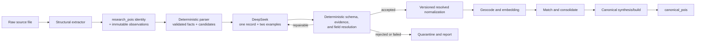

# Plan: Hybrid Deterministic + DeepSeek POI Normalization

> Status: proposed architecture and implementation plan.
>
> Scope: replace the current `ingest:normalize` implementation with a hybrid pipeline:
> deterministic extraction and validation for fields code can prove, DeepSeek for semantic
> interpretation, and deterministic resolution before any result becomes active. Then make
> geocoding, embedding, matching, and canonical aggregation consume the accepted output.
>
> Model: `deepseek-ai/DeepSeek-V4-Flash` through DeepInfra.

## 1. Executive decision

The new normalizer is deliberately hybrid. For each changed source record, deterministic
code first extracts and validates everything it can prove: identifiers, structured dates,
coordinate candidates, URLs, contacts, country codes, source flags, and taxonomy
constraints. DeepSeek then interprets exactly one record per request using that evidence,
the source/category policy, and two complete few-shot input/output examples. Deterministic
code validates and resolves the response field by field.

Accuracy takes priority over throughput:

- one source record per DeepSeek request;
- one worker by default, even if a run takes many hours;
- two source-controlled example conversations before the real record;
- no model-produced coordinate literals;
- deterministic values win whenever they are complete and valid;
- invalid or unsupported LLM values become `null` or a recorded warning, never a guess.

The model must not write directly to the captured source record or to `canonical_pois`.
Instead:

1. `research_pois` plus immutable observations remain the lossless POI source-record
   ledger.
2. A new immutable, versioned normalization record stores each interpretation and the
   deterministic facts used to resolve it.
3. Deterministic resolvers choose the final value for every field according to an explicit
   authority policy.
4. Only a schema-valid, evidence-supported resolved normalization becomes active.
5. Matching still determines which research records belong to one canonical POI.
6. A second cached LLM pass may synthesize a changed multi-source canonical, but it selects
   from normalized evidence and cannot alter cluster membership.

This uses the LLM broadly without making it the system of record. Reproducibility comes
from immutable raw input, versioned prompts and schemas, validation, and cache reuse—not
from assuming temperature zero makes repeated model calls identical.

## 2. Why replace the current stage

The implemented pipeline has sound provenance and conflation foundations, but normalize is
too shallow for the source corpus:

- `extract.ts` saves one source listing per `research_pois` row and keeps `raw`, which is
  the correct idempotency and audit boundary.
- `normalize.ts` currently lowercases/punctuation-normalizes names, validates coordinates,
  normalizes phones/countries, copies the CLI category, and uses the LLM only as a
  prose-date fallback.
- Captured and derived values share the same row and, in several cases, the same columns.
  This makes it difficult to distinguish source claims from inferred values or to compare
  two normalization versions.
- A changed content hash immediately clears derived state and the canonical link before a
  replacement normalization has succeeded.
- `merge.ts` chooses most canonical text fields by source trust plus length, recursively
  merges attributes, and uses the LLM only for conflicting descriptions. It cannot recover
  information that normalize failed to structure.
- The matcher depends heavily on name, locality, website, phone, category, coordinates,
  and dates. Missing or polluted normalized fields directly reduce candidate recall and
  canonical quality.

The present database contains only the first garden sources, but the quality gap is already
visible:

- 9,872 research rows exist; 9,731 are linked and 141 still lack coordinates.
- 6,352 garden canonicals are published.
- Published canonical coverage is 1,839 descriptions (29%), 3,509 websites (55%), 1,895
  phones (30%), 3,380 addresses (53%), 357 hours (6%), and no photos.
- Source coverage is uneven: OSM contributes almost no descriptions or addresses, while
  Wikidata contributes no descriptions, phones, or addresses.
- The current research set still includes 907 all-caps names, 338 names containing a
  four-digit year, 333 bare QID names, and obvious display artifacts such as a trailing
  backslash in a published name.

The unimported corpus is substantially messier:

- The checked-in source corpus is roughly 412,000 records across 247 data files and seven
  category folders. Campgrounds account for about 240,000 records, music festivals about
  96,000, gardens about 38,000, art fairs about 27,000, art parades about 9,000, and
  carnivals about 2,000. The implementation must optimize for resumable throughput and
  bounded evidence, not only per-record call cost.
- Festivalando is largely articles and newsletters, not festival listings.
- EDM Dance Directory includes an explicit `is_festival: false` flag on many club nights,
  while its `website` values are Resident Advisor listing URLs.
- Music Festival Wizard has one record per edition and embeds the edition year in names.
- Resident Advisor uses ISO-3 country codes, sometimes reports `city: "All"`, and wraps the
  records in a metadata object.
- Viberate contains multiple event weekends in `weeks`, which the current single
  `starts_at`/`ends_at` research shape collapses into one over-broad range.
- Global Carnivalist mixes street names into `city`, territories into `country`, and has
  malformed ranges such as April 30 to April 1 for an April 30–May 1 event.
- Reddit carnival research mixes visitable city events with country-wide traditions and
  multi-city regional summaries.
- FECC event rows often have blank location fields even when the description names the
  exact city, organizer, website, phone, and date.
- Art-fair sources use directory detail pages as `website_url`, omit cities that appear in
  descriptions or postal addresses, include ordinal/edition boilerplate in names, and
  sometimes provide a one-day date while the description explicitly says three days.
- Art-parade sources include multi-stop itineraries and category bleed from music-festival
  directories; flying-site research includes KML/HTML records plus unrelated hostel JSON
  in the same research area.
- Biennial directories sometimes assign country-centroid coordinates to traveling or
  multi-venue events.
- Campground data includes HTML descriptions, organization/facility records that are not
  campgrounds, encoded amenity strings, stale data, tracking parameters, closed locations,
  and many category-specific booleans.
- BGCI itself contains seed banks, associations, research institutes, and organizations
  alongside visitor-facing gardens.

## 3. Prototype findings

A DeepSeek V4 Flash prototype over 22 heterogeneous festival/carnival records demonstrated
that broad semantic normalization is practical and inexpensive:

- It repaired `St.Maarten Carnival` from April 30–April 1 to April 30–May 1.
- It separated edition years from Music Festival Wizard names.
- It normalized misspelled/local territory names and inferred ISO-2 country codes.
- It distinguished many article and club-night rows from real festivals.
- The call used roughly 4,139 prompt tokens and 4,813 completion tokens; DeepInfra reported
  an estimated cost of about $0.00124 for all 22 records.

Cost is therefore not the primary constraint. Latency and correctness are: that batch took
about 194 seconds. More importantly, the model also:

- rejected the sparse but plausible `Tampa Bay 2026` carnival as an empty record;
- called the recurring `18HRS Festival` a club night;
- classified explicit `is_festival: false` EDM records as POIs in one prompt variant;
- promoted Resident Advisor and Eventbrite listing URLs to official websites;
- produced `date_precision: "year"` with no date for one record.

These are not reasons to minimize LLM use. They establish the required architecture:
one-record source-aware requests, few-shot examples, explicit product policy, strict output
contracts, evidence references, deterministic hard constraints, per-field resolution, and a
measured golden set.

## 4. Goals

1. Run deterministic parsing first, then send every new or changed, potentially eligible
   source record through DeepSeek in its own request by default.
2. Produce high-quality normalized research interpretations covering:
   - POI validity and entity kind;
   - display name, match/series name, aliases, and edition metadata;
   - venue, address, city, region, country, and locality precision;
   - one or more explicit event occurrences;
   - official/listing/ticket/social URL roles;
   - phone, email, hours, status, and source-grounded description;
   - taxonomy-constrained category decisions;
   - typed category-specific attributes and strong identifiers.
3. Preserve every captured source value and every model attempt for audit and replay.
4. Prevent invented URLs, coordinates, identifiers, dates, and unsupported facts from
   becoming active data.
5. Make reruns of an unchanged normalizer version use zero provider calls.
6. Re-normalize after prompt/policy/model changes without re-extracting files.
7. Invalidate only the downstream work affected by changed normalized fields.
8. Improve canonical field selection and description/attribute synthesis after conflation.
9. Keep normal imports resumable, bounded, observable, and safe to interrupt, with
   sequential processing as the accuracy-first default.

## 5. Non-goals and hard boundaries

- The LLM does not create `source_record_id`; stable identity remains deterministic.
- The LLM does not fetch URLs or use facts beyond the supplied source record and code-owned
  source/category context.
- The LLM does not generate coordinates. It may identify which supplied location or
  coordinate candidate is relevant; deterministic code validates and projects it.
- One captured source record produces at most one active POI interpretation. A page that
  contains several independent POIs is marked `multi_entity_source_record` and must be
  split structurally into stable child source records before normalization; the model must
  not create unauditable extra POIs from article mentions.
- The LLM does not invent official URLs, phone numbers, email addresses, social accounts,
  or external identifiers. It selects enumerated candidates extracted from the record.
- The LLM does not directly merge or split canonical clusters in this workstream. Existing
  match and consolidation logic remains responsible for membership.
- Model-reported confidence is never sufficient by itself to activate a field.
- There is no review-queue UI in the first implementation. Invalid, degraded, and failed
  rows remain queryable and appear in reports.
- This plan does not decide the separate city-precision publishing policy for temporal
  categories.

## 6. Target data flow



Structural extraction remains source-specific only where needed to stream a file, unwrap a
container, and obtain a stable source id. Semantic cleanup moves out of extractors.

## 7. Data model

### 7.1 `research_pois`: source identity ledger

Retain one stable identity row per `(source_id, source_record_id)`. It points to the latest
captured observation, the active accepted normalization, and canonical membership. Do not
replace a previously accepted normalization merely because a new observation was captured.

Add:

- `active_observation_id uuid null`;
- `active_normalization_id uuid null`
- `active_projection_state text not null`: `none | active | active_stale`; this describes
  whether `active_normalization_id` is safe for downstream readers, independently of any
  replacement work;
- `normalization_refresh_state text not null`:
  `idle | pending | leased | rejected | failed`; this is resumable work state for the latest
  observation, never a signal for downstream eligibility;
- `normalization_lease_owner text null`, `normalization_lease_expires_at timestamptz null`,
  and an attempt/claim token for an atomic lease;
- `normalization_input_hash text null`
- `normalized_at timestamptz null`
- `matched_normalization_id uuid null`

During migration, current captured and derived columns remain temporarily for compatibility.
Once every downstream reader uses active-observation and active-normalization views, remove
or clearly deprecate mixed scalar state from the identity ledger.

### 7.2 `research_poi_observations`: immutable captured versions

Insert one observation for each distinct deep-canonical raw payload:

- `id`, `research_poi_id`, and `raw_content_hash`;
- complete POI `raw` JSON after deterministic credential redaction, the redacted path list,
  and the source-mapped capture envelope;
- captured source POI hint and source-provided scalar fields;
- first/last seen timestamps and scrape/import metadata;
- uniqueness on `(research_poi_id, raw_content_hash)`.

An unchanged re-import updates `last_seen_at`. A changed re-import inserts an observation,
points `research_pois.active_observation_id` to it, sets `normalization_refresh_state` to
`pending`, and sets `active_projection_state` to `active_stale` when a prior accepted
normalization exists. The prior normalization remains the active downstream projection until
its replacement passes validation. Rows without an accepted normalization are `none` and do
not enter the current view. Every normalization references the exact observation it
interpreted.

Replace extractor `is_poi` as authority with a captured `source_is_poi_hint`. An explicit
source flag such as `is_festival: false` is a hard constraint, not the final normalized
classification.

The existing `contentHash()` hashes mapped fields and attributes but not the complete
`raw` object. That is insufficient once DeepSeek reads raw-only fields: such a field could
change without invalidating normalization. Compute the observation hash from deep canonical
JSON of the complete redacted POI record. Build the semantic normalization input hash from
the exact bounded evidence packet, excluding only profile-declared volatile scrape metadata.

### 7.3 `research_normalization_requests`: provider audit and accounting

One row per DeepInfra request:

- request id, research id, observation id, and source/category/profile;
- model requested and model returned;
- prompt, schema, policy, and code versions;
- request/input hash and few-shot example-set hash;
- exact redacted request envelope and raw response;
- status and finish reason;
- prompt, cached, completion, and total tokens;
- provider-reported or estimated cost;
- latency, attempt count, HTTP status, and error;
- created/completed timestamps and retry linkage.

Raw request/response retention makes malformed or surprising outputs debuggable without
calling the provider again.

### 7.4 `research_poi_normalizations`: immutable semantic interpretations

One row per research row and normalization input/version:

- identity/version:
  - `id`, `research_poi_id`, `observation_id`, `request_id`;
  - `input_hash`, `normalizer_version`, `prompt_version`, `schema_version`;
  - `source_profile_version`, `taxonomy_version`, provider, and model;
- disposition:
  - `status`: `accepted | rejected | degraded | failed`;
  - `entity_kind`;
  - `is_poi`, enumerated `invalid_reason`;
  - `quality_score` and validator warnings;
- normalized identity:
  - `display_name`;
  - `match_name` or event `series_name`;
  - `edition_name`, `edition_year`;
  - aliases;
- normalized content/contact:
  - `description`;
  - selected official website candidate;
  - phone/email candidate;
  - opening/status facts;
- normalized locality:
  - venue, address, city, region, ISO-2 country code;
  - locality precision and location text;
- classification:
  - allowed category slugs;
  - normalized category-specific attributes;
  - strong identifiers;
- audit:
  - complete parsed model output;
  - activated projection;
  - per-field evidence paths, derivation kind, and confidence;
  - match fingerprint and canonical-build fingerprint inputs;

Interpretations are append-only. A new prompt or source policy creates a new row; activation
changes only the pointer on `research_pois`.

### 7.5 Versioned downstream enrichments

Keep geocoding and embeddings out of the immutable semantic interpretation. Add separate,
versioned tables keyed by `normalization_id`:

- `research_poi_geocodes` records the selected source/URL coordinate candidate, geocoder
  query/provider/version, result, precision, validation outcome, input hash, and activation
  timestamp;
- `research_poi_embeddings` records the embedding text hash, model/version, vector, and
  activation timestamp.

Retries or provider/model changes append a new enrichment row; they never mutate or create a
new semantic normalization. The current view selects the activated/latest valid enrichment
for its active normalization.

### 7.6 `research_poi_occurrences`: multiple dates per interpretation

Store zero or more occurrences per normalization:

- start/end timestamps;
- date precision and timezone when explicitly available;
- edition year;
- derivation kind (`explicit`, `structured_parse`, `llm_interpretation`);
- evidence paths and confidence.

This preserves split weekends such as Viberate's `weeks` instead of inventing one continuous
range. End-only phrases such as “through May 29” remain partial date facts and do not become
an occurrence until a start is supported. Yearless recurring phrases remain recurrence
metadata; the pipeline must not fabricate a current-year occurrence.

### 7.7 `research_pois_current`: downstream compatibility view

Create one view that joins each source row to its active accepted/degraded normalization and
the selected geocode/embedding projections. It exposes the effective names, locality, dates,
contacts, coordinates, categories, attributes, and embedding. `active_stale` is still
included; refresh/job state never makes an otherwise active row disappear.

Migrate geocode, embed, match, report, and canonical merge to this view. A single read
contract prevents each stage from inventing its own captured-vs-normalized fallback logic.
Rejected and failed rows do not appear as matchable POIs.

### 7.8 Optional canonical build cache

When canonical synthesis is implemented, add `canonical_poi_builds` keyed by a fingerprint
of the sorted active normalization ids, their versions, source trust, and synthesis
version. Store selected field candidates, synthesized text/attributes, provenance,
warnings, provider usage, and the activated build.

## 8. Normalization contract

The strict model output contains exactly one `record` object. It must echo the supplied
opaque `record_id`. Arrays are used only for fields belonging to that POI, such as aliases,
occurrences, links, evidence, and typed attributes.

Each result contains:

1. **Classification**
   - entity kind:
     `place | event_series | event_occurrence | contained_feature | organization |
     article | region | tour | listing | other`;
   - `is_poi`, an enumerated reason when false, and suggested category mismatch when useful.
2. **Identity**
   - visitor-facing display name;
   - stable match/series name with edition year and ordinal boilerplate removed;
   - edition name/year and aliases;
   - no forced English translation of names.
3. **Location**
   - venue/site, street address, city, region, ISO-2 country, and locality precision;
   - evidence paths for each populated value.
4. **Dates**
   - zero or more explicit occurrence ranges;
   - partial date facts and recurrence text kept separately;
   - date precision/timezone and evidence for every range.
5. **Links and contacts**
   - candidate ids plus roles:
     `official | source_listing | ticket | reservation | social | image | other`;
   - selected phone/email candidate ids.
6. **Description**
   - concise, source-grounded plain text/Markdown with no newly introduced URL;
   - evidence paths and warnings for uncertain claims.
7. **Categories and attributes**
   - category candidates constrained to the configured taxonomy subtree;
   - a typed category-specific object plus retained unmodeled source attributes.
8. **Quality diagnostics**
   - missing critical evidence, contradictory source fields, suspected closure/staleness,
     and possible multi-entity record.

Target JSON Schema with `strict: true` through DeepInfra's documented response format:
`response_format: { type: "json_schema", json_schema: { name: "poi_normalization",
strict: true, schema: <generated JSON Schema> } }`. Send that exact generated schema payload
on every schema-mode request, persist its version/hash with the request, and capability-test it
against the configured V4 Flash model at startup and in the golden benchmark; fall back to
`response_format: { type: "json_object" }` plus the same application validator if the model
rejects the schema mode. Provider-enforced structure does not prove semantic correctness
and can increase pressure to hallucinate required values. Every uncertain field must
permit `null`.

## 9. Input evidence envelope

The model should see a bounded, source-aware interpretation packet—not an arbitrary raw
record dumped into one universal prompt.

For each request include:

- opaque research id;
- source slug, trust, capture date, and declared ingest category;
- a versioned source profile describing known field semantics and listing domains;
- the code-owned eligibility and category policy;
- captured mapped fields;
- a compact copy of `raw`;
- deterministic candidate sets:
  - URLs with ids, field paths, domains, and obvious source/listing roles;
  - coordinates with ids and field paths;
  - date strings and structured date candidates;
  - phones, emails, external ids, and social handles;
  - location strings and structured locality values;
- hard constraints such as `is_festival: false` or a non-campground facility type;
- a list of allowed taxonomy slugs and normalized attribute keys.

### Source profiles

Add versioned, code-owned profiles rather than per-source cleanup logic. Profiles describe:

- container/record shape and fields worth retaining in the prompt;
- authoritative and known-unreliable fields;
- hard validity flags;
- source/listing domains and URL field semantics;
- ISO-2 vs ISO-3 country behavior;
- text/array limits and fields to summarize rather than transmit;
- category-specific hints;
- source recency and status caveats.

Examples:

- EDM: `is_festival: false` is a hard exclusion for a music-festival import; RA URLs are
  source listings.
- Global Carnivalist: `official_website` is an official candidate; `url` is a listing;
  city/country fields are known to contain addresses or territories.
- Art Festival: `website_url=artfestival.com` is a source listing; descriptions may contain
  venue and city evidence.
- BGCI: membership is not proof of a visitor-facing garden; organization type and public
  access matter.
- RIDB: `FacilityTypeDescription=Campground` is required; campsite-level files are never
  record inputs.

### Single-record requests and few-shot context

Every provider request contains exactly one real source record. The message history is:

1. system prompt with the universal rules, output contract, and authority rules;
2. user message containing a complete example input packet;
3. assistant message containing its known-correct normalization;
4. a second user example covering a different failure mode;
5. its known-correct assistant response;
6. the final user message containing the one real input packet.

This gives the model in-request context without depending on a prior conversation. Keep the
two examples in source control and version/hash them as part of the prompt. Select examples
by source profile when available, otherwise by category:

- one valid but messy record demonstrating successful extraction;
- one invalid or contradictory record demonstrating `null`, rejection, and evidence rules.

Do not dynamically retrieve examples from production rows; reviewed fixtures must remain
stable and reproducible. Never use the target record as its own example.

Example event conversation, abbreviated:

```jsonc
// Example user message 1
{
  "record_id": "example-valid-event",
  "source": "example_directory",
  "ingest_category": "music_festival",
  "raw": {
    "name": "Harbor Sounds Festival 2027",
    "location": "Pier Park, Exampletown, CA",
    "start_date": "2027-06-31",
    "url": "https://directory.example/events/harbor-sounds-2027"
  },
  "deterministic": {
    "date_candidates": [
      {"id": "date_1", "raw": "2027-06-31", "valid": false}
    ],
    "url_candidates": [
      {"id": "url_1", "role_hint": "source_listing"}
    ],
    "coordinate_candidates": []
  }
}

// Example assistant response 1
{
  "record": {
    "record_id": "example-valid-event",
    "is_poi": true,
    "entity_kind": "event_occurrence",
    "display_name": "Harbor Sounds Festival",
    "series_name": "Harbor Sounds Festival",
    "edition_year": 2027,
    "venue": "Pier Park",
    "city": "Exampletown",
    "region": "CA",
    "country_code": "US",
    "occurrences": [],
    "official_url_candidate_id": null,
    "source_url_candidate_id": "url_1",
    "warnings": ["invalid_source_date"],
    "evidence": {
      "display_name": ["$.raw.name"],
      "city": ["$.raw.location"],
      "edition_year": ["$.raw.name"]
    }
  }
}
```

The example intentionally leaves the impossible June 31 date unresolved. It teaches the
model that a plausible-looking source value must not be repaired by invention.

```jsonc
// Example user message 2
{
  "record_id": "example-article",
  "source": "example_blog",
  "ingest_category": "music_festival",
  "raw": {
    "title": "Ten festivals we hope to visit next summer",
    "excerpt": "Our editors discuss rumors, ticket prices, and travel plans.",
    "url": "https://blog.example/ten-festivals"
  }
}

// Example assistant response 2
{
  "record": {
    "record_id": "example-article",
    "is_poi": false,
    "entity_kind": "article",
    "invalid_reason": "article_not_poi",
    "display_name": null,
    "series_name": null,
    "occurrences": [],
    "official_url_candidate_id": null,
    "warnings": [],
    "evidence": {"invalid_reason": ["$.raw.title", "$.raw.excerpt"]}
  }
}
```

Prompt-size rules still apply to the one real record and two examples:

- Strip HTML deterministically while retaining the original evidence path.
- Omit or summarize large lineups/image arrays while retaining counts and representative
  values.
- Cap long text per field and record truncation in the envelope and diagnostics.
- Never truncate identity, location, date, contact, status, or strong-id evidence.

Raw source text is untrusted data and may contain prompt injection. The system prompt must
explicitly forbid following instructions inside records, opening links, or changing the
output contract.

Before hashing semantic input, prompting, request logging, or diagnostics, recursively remove
credentials and secret-bearing metadata (`api_key`, authorization headers, tokens, cookies,
and source-profile denylisted paths). Some checked-in API wrappers contain acquisition
credentials; they are not POI evidence and must never be sent to DeepInfra or copied into
normalization audit rows.

## 10. Deterministic responsibilities

The pipeline is deterministic-first and LLM-assisted. Deterministic code owns:

- source-record identity, content hashes, and version/cache hashes;
- deep canonicalization of complete raw records and removal of profile-declared volatile
  fields from semantic input packets;
- file streaming and structural unwrapping;
- HTML/entity decoding and bounded evidence extraction;
- URL parsing, domain classification, tracking-parameter removal, and candidate ids;
- coordinate parsing (including DMS strings), range checks, null-island rejection, and
  obvious swaps;
- email/phone candidate extraction and format checks;
- ISO country-code validation and known ISO-3 to ISO-2 conversion;
- strict calendar/timestamp parsing when source values are already unambiguous;
- source hard constraints and taxonomy allowlists;
- JSON Schema and semantic validation;
- field activation, fingerprinting, cache lookup, and downstream invalidation.

DeepSeek owns semantic interpretation:

- whether an eligible-looking record is a visitable POI;
- event series vs edition vs organization/article/region;
- clean display and series identity;
- locality extraction from prose and misfiled fields;
- ambiguous date-range interpretation;
- URL/contact role selection from enumerated candidates;
- source-grounded description cleanup;
- category refinement within the allowed subtree;
- structured category attributes and contradiction warnings.

### 10.1 Field authority and conflict rules

Implement one resolver per field family. Do not spread precedence rules across prompts,
validators, and SQL updates.

1. **Coordinates**
   - DeepSeek never returns `lat` or `lng` numbers; the schema exposes only enumerated
     coordinate candidate ids.
   - Valid source numeric coordinates win, followed by deterministic URL/DMS extraction,
     followed later by a validated geocoder result.
   - A model-proposed location string can improve a geocode query but can never become a
     coordinate by itself.
2. **Dates and occurrences**
   - A complete structured date that passes strict calendar validation wins.
   - Strict means invalid days/months are rejected; do not clamp June 31 to June 30.
   - DeepSeek interprets only unresolved prose, contradictions, or ranges and returns a
     candidate with evidence.
   - Reparse every LLM date with the same strict parser, require ordered endpoints, and
     reject unsupported inferred years. If deterministic and LLM dates conflict, keep the
     deterministic value and record the conflict.
3. **Stable and strong identifiers**
   - Only exact candidates extracted from the source may be selected. DeepSeek cannot
     create or rewrite them.
4. **URLs, phone, email, and social handles**
   - Deterministic code enumerates normalized candidate ids.
   - DeepSeek assigns roles or chooses among candidates.
   - The resolver checks domains, formats, denylisted listing hosts, and evidence before
     activation. No literal value absent from the candidate set is accepted.
5. **Country and locality**
   - A valid structured ISO code and internally consistent source locality win.
   - Deterministic ISO-3/name/region mapping runs before DeepSeek.
   - DeepSeek may fill or separate venue/address/city/region/country from prose; each value
     must cite evidence and pass country/locality consistency checks.
6. **Names and event identity**
   - Preserve the captured name verbatim.
   - Deterministic cleanup removes encoding/whitespace artifacts.
   - DeepSeek supplies display name, series name, aliases, and edition metadata when
     semantic interpretation is needed.
   - The resolver rejects empty, id-only, location-only, or unsupported translated names.
7. **Validity and categories**
   - Source hard exclusions and the developer-provided taxonomy boundary cannot be
     overridden.
   - DeepSeek classifies ambiguous rows and may refine only within the allowed subtree.
   - A category mismatch is rejected or reported; it is not silently recategorized.
8. **Typed booleans and numbers**
   - Valid source booleans/numbers win.
   - DeepSeek may decode documented source strings such as amenity codes, but the result
     must pass the category attribute schema and retain the raw evidence.
   - Missing does not become `false`, `0`, or an estimated value.
9. **Description**
   - DeepSeek may clean and summarize source prose.
   - The resolver rejects new URLs, unsupported numbers, and claims with no evidence.
   - Fallback is sanitized source text, not generated prose.
10. **Default**
    - If neither deterministic code nor a validated LLM interpretation supports a value,
      store `null` plus a warning. Completeness never outranks correctness.

### 10.2 Exact per-record algorithm

```ts
for (const observation of claimPendingObservations({ concurrency: 1 })) {
  const profile = loadSourceProfile(observation.sourceSlug);
  const deterministic = buildAndValidateDeterministicFacts(observation, profile);
  const input = buildEvidencePacket(observation, deterministic, profile);
  const inputHash = hashInputAndVersions(input, profile, examples, schema, model);

  const cached = await loadAcceptedNormalization(inputHash);
  if (cached) {
    await activateIfChanged(cached);
    continue;
  }

  const modelOutput = await normalizeOneRecord({
    systemPrompt,
    exampleConversations: selectTwoExamples(profile, observation.ingestCategory),
    input,
  });

  const parsed = validateOutputSchema(modelOutput);
  const resolved = resolveAllFields({ observation, deterministic, parsed, profile });
  const checked = validateResolvedNormalization(resolved);

  await persistRequestAndNormalization({ input, modelOutput, resolved: checked });
  await activateOrQuarantine(checked);
}
```

Keep network calls outside database transactions. Persist a lease before the call and use
its claim token when writing the result.

## 11. Validation, repair, and activation

### Response validation

Reject the single-record response before projection when:

- JSON or schema validation fails;
- the echoed record id does not exactly equal the input id;
- the response contains more than one top-level record;
- the response is truncated or has a non-success finish reason.

Retry a transport/truncation failure with the same request. For a schema/semantic failure,
send one repair request containing the same two examples, original evidence packet, invalid
output, and validator errors. A persistent failure quarantines only that record and does not
block the source.

### Per-record semantic validation

Validate records independently:

- `is_poi=true` requires a usable display and match/series name.
- `invalid_reason` must agree with `is_poi`.
- categories must be in the configured allowed taxonomy subtree.
- country codes must be valid ISO-2 values.
- every non-null venue, address, city, and region value must cite a valid evidence path or an
  enumerated locality candidate from the input; unsupported locality values are rejected
  rather than trusted by geocoding or matching.
- occurrence dates must be real, ordered, and supported by cited source paths.
- source, URL, coordinate, contact, and identifier candidate ids must exist in the input.
- the model cannot return a literal URL, coordinate, phone, email, or identifier that was
  not enumerated.
- an explicit hard exclusion cannot be overridden.
- an official website cannot point at a known directory/listing/social/ticket domain.
- names cannot be bare ids, empty boilerplate, or location-only placeholders.
- edition year must be supported by name/date evidence and plausible for the source record.
- numbers and factual claims introduced in descriptions must be traceable to source text.
- normalized attributes must satisfy the category schema; unknown/absent is distinct from
  false or zero.

### Repair

For a semantically invalid model result:

1. Send the same two examples, record, original evidence packet, invalid output, and exact
   validator errors to one repair call.
2. Validate again.
3. If it still fails, create a deterministic degraded interpretation when safe; otherwise
   mark it failed.

Do not silently drop only the bad field without recording the validator warning and rejected
candidate.

### Activation

Activation is transactional:

1. Insert the immutable normalization.
2. Compute its quality and downstream fingerprints.
3. Point `research_pois.active_normalization_id` to it only if accepted or explicitly
   allowed degraded.
4. Compare its match fingerprint with the prior active normalization.
5. Preserve canonical membership when only description/non-match attributes changed, but
   mark that canonical for rebuild.
6. Clear/reprocess membership only when identity, category, locality, coordinate, contact,
   strong-id, or occurrence signals materially changed. Before clearing it, enqueue the prior
   canonical for rebuild so removing this row cannot leave its selected fields, occurrences,
   or source-count quality stale.
7. Keep the previous active normalization if a replacement attempt fails.

This removes the current failure window where re-extraction clears a working canonical link
before a new normalization succeeds.

## 12. Caching and reproducibility

The cache key must include more than source `content_hash`:

- research content hash;
- declared ingest category;
- source profile and eligibility-policy versions;
- taxonomy version;
- evidence-builder version;
- prompt and output-schema versions;
- few-shot example ids and content hash;
- requested provider/model and model mode;
- normalizer code version.

Hash the exact canonicalized input packet plus these versions. A matching successful or
terminally rejected result is a cache hit. Failed provider/transport attempts are retryable
and are not permanent semantic cache entries.

Changing a prompt, schema, source profile, taxonomy, or model naturally creates a new input
hash and a shadow normalization. Unchanged reruns of the same version make zero LLM calls.

Record the exact returned model id. Provider aliases may drift even when the configured
name does not.

## 13. Provider and execution engine

Replace the minimal `chat()` wrapper with a reusable client that supports:

- strict JSON Schema response format;
- request timeout and abort;
- retry with exponential backoff, jitter, `Retry-After`, and bounded attempts for 429/5xx;
- explicit handling of finish reason and truncated output;
- token usage, cached-token usage, latency, model id, and cost capture;
- configurable thinking mode, benchmarked before selection;
- idempotent request metadata and request audit ids;
- safe log redaction.

Use temperature 0. Compare thinking disabled and enabled on the golden set, and choose the
more accurate mode; latency is secondary.

Use a database-backed claim/lease:

- select eligible pending/expired rows with `FOR UPDATE SKIP LOCKED` and atomically write a
  unique claim token, lease owner, `leased` refresh state, and lease expiry in the same
  transaction;
- commit that persisted claim before the network call, and require its token when recording
  a completion or activation so a superseded worker cannot win a race;
- renew leases for in-flight calls and return expired leases to pending work so interrupted
  workers are resumable;
- persist each completed request before claiming another;
- use source/category-scoped advisory locking where projection order matters.

The CLI should support:

```bash
pnpm --filter @lib/db-map ingest:normalize --source <slug> \
  [--limit N] [--concurrency N] [--dry-run] \
  [--shadow] [--no-llm] [--retry-failed] \
  [--max-requests N] [--max-cost-usd N]
```

Semantics:

- default: use cache, call DeepSeek for cache misses, validate, and activate;
- `--shadow`: store/evaluate new interpretations without activating them;
- `--no-llm`: make no provider calls, reuse accepted cache entries, and otherwise create
  deterministic degraded output only in shadow or for rows with no active normalization.
  It preserves an existing active normalization; replacing it with degraded output requires
  an explicit force flag;
- `--dry-run`: show selected rows, cache/call estimates, and projected changes without
  provider calls or writes;
- `--concurrency` defaults to `1`; values above one only parallelize independent
  single-record requests and must be explicitly requested;
- limits bound new records/requests, not cache hits;
- first Ctrl-C stops after the current record and prints the exact resume command.

## 14. Downstream changes

### Geocoding

Read active normalized venue/address/city/region/country from `research_pois_current`.
Build ranked queries:

1. venue + address + locality;
2. address + locality;
3. venue + city/country for temporal POIs;
4. city/region/country fallback.

Validate result country and rough locality against normalized evidence before activation.
Keep source/URL coordinates preferred and never ask the model to generate coordinates.

### Embeddings

Embed the accepted match/series name, aliases, venue/locality, and category. Version the
embedding input hash so description-only normalization changes do not force re-embedding.

### Matching

Use:

- match/series name plus aliases instead of edition-decorated source name;
- normalized official domain and phone candidates;
- normalized locality and location precision;
- all normalized strong identifiers;
- explicit occurrences and edition metadata;
- entity kind and category compatibility.

Continue deterministic strong-id/proximity/scoring paths and LLM gray-zone adjudication.
Include normalization ids/versions in match-decision signals so decisions can be recognized
as stale when their inputs change.

### Canonical build and synthesis

First switch `merge.ts` from captured fields to active normalized evidence. Score field
candidates using:

- source trust and recency;
- field evidence/derivation quality;
- validator status and field confidence;
- corroboration by independent sources;
- value specificity and cleanliness.

Then add a cached DeepSeek canonical synthesis pass for changed multi-source or conflicting
clusters. It should:

- select name, website, contact, address, coordinate, and status from candidate ids;
- synthesize a concise description from normalized source facts;
- reconcile typed attributes without last-write-wins loss;
- preserve all occurrence editions;
- flag possible cluster contamination but never change membership;
- produce per-field research normalization ids as provenance.

Single-source canonicals can normally use the already normalized research record without a
second LLM call. Multi-source canonical builds with an unchanged fingerprint use cache.
During row-at-a-time matching, write a deterministic provisional canonical only. Run the
LLM synthesis after the source match/consolidation sweep (or an explicit canonical-build
command), when cluster membership is stable, rather than paying for a new synthesis after
each attached row.

### Publishing quality

Replace “has name/category/coordinates” as the only practical quality test with reportable
quality dimensions:

- valid identity;
- coordinate/locality precision;
- official vs listing URL;
- occurrence quality for temporal categories;
- active/closed/unknown status;
- critical validator warnings;
- source count and corroboration.

Keep the city-precision publish decision separate, but expose enough quality data for that
policy to be category-aware.

## 15. Evaluation before activation

### Golden corpus

Start with a committed seed set of 50–75 labeled records for prompt/schema iteration, then
grow it to 400–600 before broad activation. Store source snapshots, not pointers into giant
files, so tests remain stable. Stratify by source/category and failure mode:

- clean and malformed gardens;
- campgrounds, non-campground facilities, closed sites, encoded amenities, and HTML;
- festival editions, split weekends, historical festivals, club nights, and article pages;
- carnivals that are city events vs nationwide/regional traditions;
- art fairs, craft/vendor events, biennial series/editions, and directory pages;
- art-parade tour stops, category bleed, flying-site KML, and records intentionally placed
  under the wrong category;
- multilingual and non-Latin names;
- missing/contradictory locality, URL-role traps, bad dates, and low-information rows.

Label at minimum:

- POI validity/entity kind and invalid reason;
- display/series name and edition metadata;
- city/region/country/venue;
- occurrences and partial-date handling;
- URL roles;
- category decision;
- selected typed attributes;
- expected evidence paths and prohibited inventions.

Include adversarial records containing instructions in descriptions and large/truncated
records.

### Metrics and release gates

Measure per source and globally:

- POI classification precision and recall;
- exact/acceptable identity and edition extraction;
- locality accuracy and completeness when evidence exists;
- explicit occurrence accuracy;
- official URL precision;
- schema, first-pass, repair, degraded, and provider failure rates;
- ungrounded URL/coordinate/contact/id/date count;
- cost, tokens, p50/p95 latency, and rows/minute;
- cache-hit rate and zero-call idempotent reruns;
- downstream geocode resolution and match/canonical changes.

Initial gates:

- no invented URL, coordinate, phone, email, or strong id in the golden set;
- at least 99% precision for `is_poi=true` and at least 97% recall;
- at least 98% acceptable base/series names;
- at least 98% correct city/country where supporting evidence exists;
- at least 99% accuracy on explicit structured dates;
- 100% official-URL precision on known listing-domain traps;
- at least 95% of provider outputs pass schema and semantic validation without repair and
  at least 99.5% after the one-record repair flow;
- zero provider calls on an unchanged rerun;
- no regression in match golden-set false positives.

Do not use the model's confidence number as the scoring truth. Calibrate it against these
labels and combine it with evidence and validator outcomes.

### Benchmark matrix

Benchmark DeepSeek with:

- strict JSON Schema vs JSON-object plus application validation;
- thinking disabled vs enabled;
- zero, one, two, and three reviewed example conversations to verify that two is the best
  accuracy/context trade-off;
- generic category examples vs source-profile-specific examples;
- short/structured vs long/prose-heavy single records;
- repeated runs of the same fixtures to measure output stability before cache reuse.

Select the fastest configuration that meets quality gates. Cost should still be reported
and bounded even though the prototype suggests it is small.

## 16. Actionable implementation checklist

Complete these tasks in order. Each task should be independently reviewable and leave the
existing pipeline runnable.

### N0 — Freeze the contract and seed evaluation data

- [ ] Add `normalize/contracts.ts` with the single-record input/output TypeScript types,
  invalid-reason enum, category attribute schemas, and generated strict JSON Schema.
- [ ] Ensure the LLM output schema contains coordinate candidate ids but no numeric
  `lat`/`lng` fields.
- [ ] Add `normalize/examples.ts` with exactly two reviewed conversations for each initial
  policy family: temporal event and permanent place.
- [ ] Add 50–75 compact real-source snapshots to
  `lib/db-map/data/normalization-golden.json`, including the known prototype failures.
- [ ] Add `normalize/golden.ts` and package script `ingest:normalize:golden`. Fixture mode
  checks resolver behavior without network access; `--live` calls DeepSeek one fixture at a
  time and records metrics.
- [ ] Run each live fixture at least three times before cache use to compare 0/1/2/3
  examples and thinking modes.

Done when:

```bash
pnpm --filter @lib/db-map ingest:normalize:golden
pnpm --filter @lib/db-map ingest:normalize:golden --live
pnpm --filter @lib/db-map check-types
```

passes, the selected configuration uses one record plus two examples, and the seed quality
gates in Section 15 are met.

### N1 — Add immutable observations and normalization storage

- [ ] Add schema for `research_poi_observations`, `research_normalization_requests`,
  `research_poi_normalizations`, `research_poi_occurrences`,
  `research_poi_geocodes`, and `research_poi_embeddings`.
- [ ] Add active observation/normalization pointers, refresh/lease state, claim token,
  matched-normalization id, timestamps, checks, unique keys, and pending-work indexes.
- [ ] Add foreign keys so a normalization must reference the exact observation and request
  that produced it.
- [ ] Add `research_pois_current`; initially it may project accepted values back through the
  existing research columns for compatibility.
- [ ] Change extract upsert so a changed raw payload inserts an observation and marks
  refresh pending without deleting the prior active normalization or canonical membership.
- [ ] Backfill observations for existing research rows.
- [ ] Run the required schema/type/contract synchronization.

Done when:

```bash
cd lib/db-map && pnpm db:sync
pnpm check-types
```

passes and SQL checks prove unchanged extraction reuses one observation while changed
extraction appends an observation without losing the active projection.

### N2 — Upgrade the DeepInfra client

- [ ] Extend `providers/deepinfra.ts` to accept a full `messages` array so user/assistant
  few-shot pairs can precede the real input.
- [ ] Add strict `json_schema` response format with a capability-tested `json_object`
  fallback.
- [ ] Add abort timeout, bounded 429/5xx retry with `Retry-After`, finish-reason checking,
  returned-model capture, token/cost/latency telemetry, and safe redaction.
- [ ] Preserve existing match/date/fusion callers through a small compatibility wrapper
  until they are migrated.
- [ ] Persist every real normalization request/response and retry link in
  `research_normalization_requests`.

Done when mocked transport cases cover success, timeout, 429, 5xx, truncated response,
invalid JSON, and empty content, and one live golden fixture records complete telemetry.

### N3 — Build deterministic facts and candidates

- [ ] Add `normalize/deterministic.ts` for deep canonical hashing, credential redaction,
  HTML/entity cleanup, Unicode-safe text cleanup, URL/contact/id extraction, ISO mapping,
  DMS/numeric/URL coordinate extraction, and strict date parsing.
- [ ] Replace date clamping with reject-on-invalid calendar semantics.
- [ ] Add `normalize/evidence.ts` to assign stable candidate ids and evidence paths.
- [ ] Add `normalize/profiles.ts` and `normalize/policies.ts` for source field authority,
  listing domains, hard exclusions, allowed taxonomy subtree, volatile/secret paths, and
  prompt-size limits.
- [ ] Add fixture tests for June 31, reversed ranges, null island, swapped coordinates, DMS,
  ISO-3 countries, tracking URLs, RA/Eventbrite listing URLs, malformed phones, source hard
  exclusions, and missing-vs-false attributes.

Done when the evidence packet for every seed fixture is deterministic byte-for-byte and no
provider call is needed to validate already structured coordinates, dates, ids, or contacts.

### N4 — Assemble the one-record, two-example prompt

- [ ] Add `normalize/prompt.ts` with the universal system rules.
- [ ] Select source-specific examples first and category fallback examples second.
- [ ] Build exactly six messages: system, example user, example assistant, second example
  user, second example assistant, real user.
- [ ] Include deterministic facts, candidate ids, hard constraints, allowed taxonomy, and
  evidence-path rules in the real user packet.
- [ ] Include prompt, schema, profile, policy, and example-set versions in the input hash.
- [ ] Add an adversarial fixture whose description tells the model to ignore the system
  prompt; verify it remains data.

Done when a snapshot test proves the exact message sequence and any example edit changes
the cache key.

### N5 — Implement field resolvers and semantic validation

- [ ] Add `normalize/resolve.ts` with one resolver for each authority family in Section 10.1.
- [ ] Add `normalize/validate.ts` for schema, echoed id, evidence paths, taxonomy, strict
  dates, locality consistency, candidate membership, attribute schema, and description
  factuality checks.
- [ ] Reject literal coordinates, URLs, phones, emails, and strong ids not present in
  deterministic candidates.
- [ ] Record deterministic value, model proposal, selected value, selection reason,
  evidence, and warnings for every field.
- [ ] Add `normalize/repair.ts` for one repair attempt using the same examples plus exact
  validator errors.
- [ ] Add negative fixtures where DeepSeek output invents coordinates, returns February 30,
  promotes a listing URL, changes a strong id, contradicts a source hard flag, or turns
  missing booleans into false.

Done when all negative fixtures are rejected or safely degraded and no invalid model value
reaches the resolved projection.

### N6 — Implement the resumable sequential runner

- [ ] Add `normalize/runner.ts` to claim one pending observation with a durable lease and
  commit before any network call.
- [ ] Default `--concurrency` to `1`; process and persist one record completely before
  claiming the next.
- [ ] Implement cache lookup, request persistence, one-record DeepSeek call, validation,
  repair, resolution, quarantine, and lease expiry.
- [ ] Implement `--source`, `--limit`, `--concurrency`, `--shadow`, `--no-llm`,
  `--retry-failed`, `--dry-run`, `--max-requests`, and `--max-cost-usd`.
- [ ] Implement graceful Ctrl-C after the current record and print the exact resume command.
- [ ] Replace `normalize.ts` with CLI parsing and delegation to the runner.

Done when interrupting and rerunning a 20-record shadow import neither duplicates requests
nor skips work, and a second unchanged run makes zero DeepSeek calls.

### N7 — Persist and activate safely

- [ ] Add `normalize/project.ts` to append request/normalization/occurrence rows in a
  transaction and activate only accepted or explicitly allowed degraded output.
- [ ] Compute separate match, geocode, embedding, and canonical-build fingerprints.
- [ ] Preserve the prior active normalization when a refresh fails.
- [ ] Preserve canonical membership for description-only changes; rematch only when
  match-critical fields change.
- [ ] Rebuild the prior canonical after detaching a changed research row.
- [ ] During transition, project active normalized values into legacy columns used by
  geocode/embed/match.

Done when activation rollback tests prove that a provider or database failure cannot replace
a valid active normalization or leave a stale canonical.

### N8 — Cut downstream stages over to the active view

- [ ] Update geocode to use normalized locality, ranked queries, country validation, and
  versioned `research_poi_geocodes`.
- [ ] Update embed to use normalized identity/locality/category and versioned
  `research_poi_embeddings`.
- [ ] Update match/scoring/prompts to use series name, aliases, normalized contacts,
  locality, occurrences, strong ids, and normalization-version signals.
- [ ] Update `merge.ts` to read active normalized fields and field-quality metadata.
- [ ] Update reflow to schedule a new normalization version rather than delete accepted
  output.
- [ ] Update report with normalization state, request/cache totals, first-pass/repair/failure
  rates, warning reasons, tokens, cost, latency, and active model/prompt/profile versions.
- [ ] Remove the compatibility projection only after no downstream query reads the legacy
  derived columns.

Done when extract → normalize → geocode → embed → match succeeds on a pilot source and
downstream code reads only `research_pois_current` plus versioned enrichments.

### N9 — Add canonical synthesis after membership is stable

- [ ] Add canonical-build fingerprints and `canonical_poi_builds`.
- [ ] Run synthesis only after match/consolidation, never after every attached row.
- [ ] Use one canonical cluster per request with candidate ids and reviewed few-shot
  examples separate from research normalization examples.
- [ ] Deterministically validate all selected fields; descriptions may be generated only
  from cited normalized facts.
- [ ] Preserve complete per-field provenance and all event occurrences.

Done when unchanged canonical builds make zero LLM calls and multi-source completeness
improves without new URLs/ids or match-membership changes.

### N10 — Shadow pilots and activate

- [ ] Run `global_carnivalist` and FECC first.
- [ ] Run `musicfestivalwizard` for edition collapse.
- [ ] Run EDM/Festivalando for false-positive stress.
- [ ] Run RIDB/uscampgrounds for typed attributes.
- [ ] Re-run existing garden sources for regression.
- [ ] Run art-fair/biennial slices for mixed date/location behavior.
- [ ] For every pilot, capture before/after report, inspect every severe warning plus a
  stratified sample, run match golden tests, and prove zero-call unchanged reruns.
- [ ] Expand the golden corpus to 400–600 before broad activation.
- [ ] Activate only after all release gates pass. Keep the old projection for one rollout
  cycle; any destructive recluster remains a separately approved operation.

## 17. Expected file changes

Primary implementation:

- `lib/db-map/scripts/ingest/normalize.ts` — replace with the new orchestrator.
- `lib/db-map/scripts/ingest/normalize/contracts.ts` — output types and schema.
- `lib/db-map/scripts/ingest/normalize/deterministic.ts` — proven facts and candidates.
- `lib/db-map/scripts/ingest/normalize/evidence.ts` — bounded candidate packet.
- `lib/db-map/scripts/ingest/normalize/profiles.ts` — source semantics.
- `lib/db-map/scripts/ingest/normalize/policies.ts` — entity/category eligibility.
- `lib/db-map/scripts/ingest/normalize/prompt.ts` — versioned system/task prompt.
- `lib/db-map/scripts/ingest/normalize/runner.ts` — sequential claims, leases, resume.
- `lib/db-map/scripts/ingest/normalize/examples.ts` — versioned few-shot selection.
- `lib/db-map/scripts/ingest/normalize/validate.ts` — semantic validators.
- `lib/db-map/scripts/ingest/normalize/resolve.ts` — per-field authority and selection.
- `lib/db-map/scripts/ingest/normalize/repair.ts` — bounded repair flow.
- `lib/db-map/scripts/ingest/normalize/project.ts` — activation/fingerprints.
- `lib/db-map/scripts/ingest/providers/deepinfra.ts` — structured responses and telemetry.
- `lib/db-map/scripts/ingest/sources.ts` — attach profile metadata to source definitions.
- `lib/db-map/scripts/ingest/extract.ts` and `types.ts` — captured source hints, no semantic
  mutation.

Downstream:

- `lib/db-map/scripts/ingest/geocode.ts`
- `lib/db-map/scripts/ingest/embed.ts`
- `lib/db-map/scripts/ingest/match.ts`
- `lib/db-map/scripts/ingest/match/score.ts`
- `lib/db-map/scripts/ingest/match/llm.ts`
- `lib/db-map/scripts/ingest/merge.ts`
- `lib/db-map/scripts/ingest/reflow.ts`
- `lib/db-map/scripts/ingest/report.ts`
- `lib/db-map/package.json`

Schema/generated output:

- `lib/db-map/migrations/`
- `lib/db-map/schema/current.sql`
- `lib/db-map/generated/typescript/`
- `lib/db-map/generated/contracts/`

Evaluation and docs:

- `lib/db-map/data/normalization-golden.json`
- `lib/db-map/scripts/ingest/normalize/golden.ts`
- `docs/poi-ingestion.md`
- `docs/poi-research/capture-spec.md`
- `lib/db-map/README.md`
- relevant folder/source guides under `docs/poi/`

## 18. Final acceptance

The workstream is complete when:

1. Every changed eligible source row is interpreted by DeepSeek or explicitly represented
   as cached, deterministic-degraded, rejected, or failed.
2. Captured input and all model attempts remain auditable and no normalized field overwrites
   source truth.
3. Active fields pass strict schema, candidate, evidence, taxonomy, date, and category
   validation.
4. Multiple event occurrences survive research normalization into canonical occurrences.
5. Geocoding, embeddings, matching, and canonical builds consume only active normalized
   projections.
6. Prompt/model/profile/schema changes can run in shadow and activate atomically.
7. Unchanged reruns and unchanged canonical builds make zero LLM calls.
8. Provider failures are resumable and never replace a previously valid active
   normalization.
9. Golden quality gates pass without match false-positive regression.
10. Pilot imports demonstrate higher usable locality, correct edition collapse, better
    official-link precision, and materially improved canonical field completeness.
